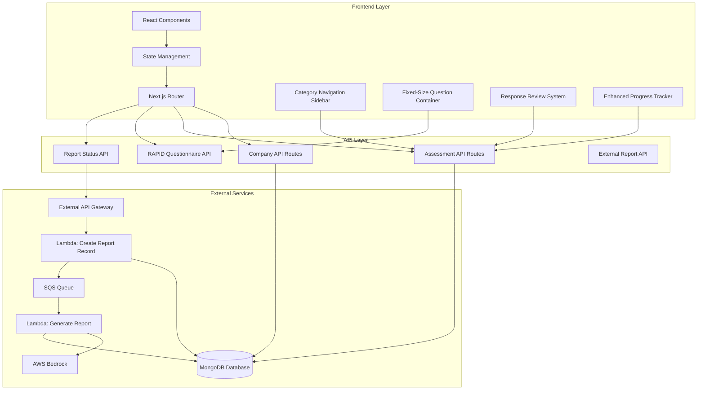
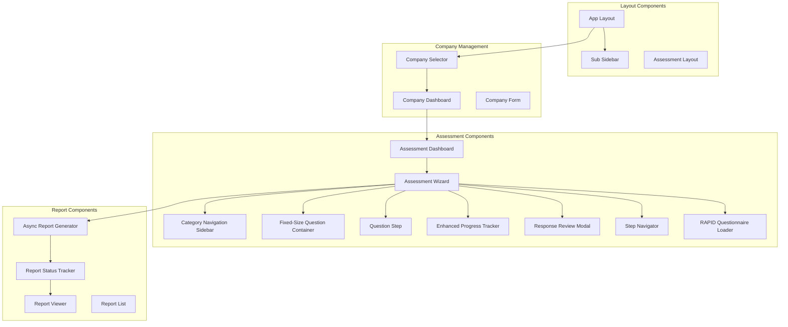

# Design Document

## Overview

AI Assessment module เป็นระบบประเมินความพร้อม GenAI ที่ออกแบบให้รองรับการทำงานแบบ multi-company และ multi-assessment โดยเน้นการพัฒนาแบบ phase-based development (UI ก่อน แล้วค่อย data persistence) เพื่อให้สามารถทดสอบ application flow ได้เร็วขึ้น

ระบบรองรับ 2 เส้นทางหลัก: Exploratory Path (5 categories) สำหรับการพัฒนา AI ใหม่ และ Migration Path (6 categories) สำหรับการ migrate AI ที่มีอยู่ โดยใช้ MongoDB เป็นฐานข้อมูลหลักและ **External API Gateway + Lambda + SQS architecture** สำหรับการสร้างรายงานแบบ asynchronous โดยระบบจะไม่เรียก AWS Bedrock โดยตรง แต่จะส่งข้อมูลไปยัง External API Gateway ที่จะจัดการการสร้างรายงานผ่าน Lambda functions และ SQS queue

**ฟีเจอร์ใหม่ที่เพิ่มเข้ามา:**
- **RAPID Questionnaire Integration**: คำถามใหม่ทั้งหมด 162 ข้อจาก RAPID Assessment Questionnaires
- **Category-Based Navigation**: จัดระเบียบคำถามตาม categories และ subcategories
- **Enhanced Progress Sidebar**: แสดง progress navigation ด้านซ้ายที่คลิกกระโดดได้
- **Fixed-Size Question Container**: กล่องคำถามขนาดคงที่เพื่อ UI ที่สวยและเสถียร
- **Response Review System**: ให้ผู้ใช้สามารถดูคำตอบที่กรอกไปแล้วและทบทวนทั้งหมดก่อนส่ง assessment
- **Asynchronous Report Generation**: ใช้ External API Gateway + Lambda + SQS แทนการเรียก AWS Bedrock โดยตรง พร้อม status tracking และ polling mechanism

**RAPID Questionnaire Structure:**
- **Exploratory Path**: 5 main categories with 110 total questions
  - Use Case Discovery: 48 questions (5 subcategories)
  - Data Readiness: 25 questions (4 subcategories) 
  - Compliance & Integration: 27 questions (5 subcategories)
  - Model Evaluation: Guided process
  - Business Value & ROI: 10 questions (1 category)

- **Migration Path**: 6 main categories with 162 total questions
  - All Exploratory categories plus:
  - Current System Assessment: 52 questions (8 subcategories)

## Architecture

### High-Level Architecture



### Component Architecture



## Components and Interfaces

### Core Components

#### 1. SubSidebar Component
```typescript
interface SubSidebarProps {
  activeModule: string
  onModuleChange: (module: string) => void
}

interface SubSidebarItem {
  id: string
  label: string
  icon: React.ComponentType
  path: string
  isActive: boolean
}
```

**Responsibilities:**
- Display navigation menu with "AI Assessment" and "Company Settings"
- Handle active state highlighting
- Responsive collapse on mobile devices

#### 2. CategoryNavigationSidebar Component
```typescript
interface CategoryNavigationSidebarProps {
  categories: AssessmentCategory[]
  currentCategory: string
  onCategorySelect: (categoryId: string) => void
  completionStatus: CategoryCompletionStatus[]
}

interface AssessmentCategory {
  id: string
  title: string
  questionCount: number
  completionPercentage: number
  status: 'not_started' | 'partial' | 'completed'
}

interface CategoryCompletionStatus {
  categoryId: string
  completionPercentage: number
  status: 'not_started' | 'partial' | 'completed'
}
```

**Responsibilities:**
- Display main categories in left sidebar
- Show visual progress indicators for each category
- Handle clickable navigation to categories
- Highlight current active category

#### 3. FixedQuestionContainer Component
```typescript
interface FixedQuestionContainerProps {
  children: React.ReactNode
  className?: string
}
```

**Responsibilities:**
- Maintain consistent container dimensions
- Implement scrolling when content exceeds container size
- Provide responsive design for different screen sizes

#### 4. RAPIDQuestionnaireLoader Component
```typescript
interface RAPIDQuestionnaireLoaderProps {
  assessmentType: 'EXPLORATORY' | 'MIGRATION'
  onQuestionsLoaded: (questions: RAPIDQuestionStructure) => void
}

interface RAPIDQuestionStructure {
  totalQuestions: number
  categories: RAPIDCategory[]
}

interface RAPIDCategory {
  id: string
  title: string
  questionCount: number
  questions: RAPIDQuestion[]
}

interface RAPIDQuestion {
  id: string
  number: string
  text: string
  type: 'text' | 'textarea' | 'select' | 'radio' | 'checkbox'
  required: boolean
  options?: string[]
  category: string
}
```

**Responsibilities:**
- Load RAPID questionnaire structure from data source
- Organize questions by categories
- Handle different structures for Exploratory vs Migration paths

#### 5. CompanySelector Component
```typescript
interface CompanySelectorProps {
  companies: Company[]
  selectedCompany: Company | null
  onCompanySelect: (company: Company) => void
  onCreateNew: () => void
}

interface Company {
  id: string
  name: string
  description?: string
  createdAt: Date
  assessmentCount: number
}
```

**Responsibilities:**
- Display available companies in dropdown or grid format
- Handle company selection
- Redirect to Company Settings if no companies exist

#### 6. AssessmentDashboard Component
```typescript
interface AssessmentDashboardProps {
  company: Company
  assessments: Assessment[]
  onCreateAssessment: () => void
  onSelectAssessment: (assessment: Assessment) => void
  onDeleteAssessment: (assessmentId: string) => void
}

interface Assessment {
  id: string
  name: string
  companyId: string
  type: 'EXPLORATORY' | 'MIGRATION'
  status: 'DRAFT' | 'IN_PROGRESS' | 'COMPLETED'
  currentCategory: string
  currentSubcategory?: string
  totalCategories: number
  completionPercentage: number
  createdAt: Date
  updatedAt: Date
  completedAt?: Date
}
```

**Responsibilities:**
- Display assessments for selected company
- Show assessment status and progress
- Provide CRUD operations for assessments

#### 7. AssessmentWizard Component
```typescript
interface AssessmentWizardProps {
  assessment: Assessment
  rapidQuestions: RAPIDQuestionStructure
  responses: AssessmentResponses
  onResponseChange: (categoryId: string, responses: any) => void
  onCategoryChange: (categoryId: string) => void
  onComplete: () => void
}

interface QuestionSection {
  id: string
  title: string
  questions: RAPIDQuestion[]
  categoryId: string
  completionStatus: 'not_started' | 'partial' | 'completed'
}
```

**Responsibilities:**
- Manage category-based questionnaire flow
- Handle form validation and error display
- Auto-save responses every 30 seconds
- Coordinate with CategoryNavigationSidebar and FixedQuestionContainer

#### 8. EnhancedProgressTracker Component
```typescript
interface EnhancedProgressTrackerProps {
  categories: AssessmentCategory[]
  currentCategory: string
  categoryStatuses: CategoryCompletionStatus[]
  onCategoryClick: (categoryId: string) => void
}
```

**Responsibilities:**
- Display visual progress for each category
- Allow direct navigation to categories by clicking
- Show completion indicators and progress percentages
- Highlight current category

#### 9. ResponseReviewModal Component
```typescript
interface ResponseReviewModalProps {
  isOpen: boolean
  assessment: Assessment
  responses: AssessmentResponses
  rapidQuestions: RAPIDQuestionStructure
  onClose: () => void
  onEditResponse: (categoryId: string, questionId: string) => void
  onComplete: () => void
}

interface ReviewSummary {
  categoryId: string
  categoryTitle: string
  questions: ReviewQuestion[]
  completionPercentage: number
}

interface ReviewQuestion {
  id: string
  number: string
  label: string
  answer: any
  required: boolean
  isEmpty: boolean
}
```

**Responsibilities:**
- Display comprehensive review of all questions and answers by categories
- Highlight unanswered required questions
- Allow direct navigation to specific questions for editing
- Provide final completion validation

#### 7. AsyncReportGenerator Component
```typescript
interface AsyncReportGeneratorProps {
  assessment: Assessment
  responses: AssessmentResponses
  onReportRequested: (requestId: string) => void
  onReportCompleted: (report: AssessmentReport) => void
}

interface ReportGenerationRequest {
  id: string
  assessmentId: string
  companyId: string
  status: 'PENDING' | 'PROCESSING' | 'COMPLETED' | 'FAILED'
  requestedAt: Date
  completedAt?: Date
  errorMessage?: string
  externalRequestId: string
  retryCount: number
}
```

**Responsibilities:**
- Send report generation requests to External API Gateway
- Track request status through polling mechanism
- Handle asynchronous report completion
- Provide retry functionality for failed requests
- Display request progress and estimated completion time

#### 8. ReportStatusTracker Component
```typescript
interface ReportStatusTrackerProps {
  requests: ReportGenerationRequest[]
  onRefreshStatus: () => void
  onViewReport: (reportId: string) => void
  onRetryGeneration: (requestId: string) => void
  pollingInterval?: number
}

interface ReportStatusUpdate {
  requestId: string
  status: 'PENDING' | 'PROCESSING' | 'COMPLETED' | 'FAILED'
  progress?: number
  estimatedCompletionTime?: Date
  errorDetails?: string
}
```

**Responsibilities:**
- Track multiple report generation requests from MongoDB_Database
- Query database periodically for status updates instead of external API calls
- Display request history and current status from database records
- Handle error states and retry mechanisms
- Manage automatic status refresh from database queries

### Data Models

#### MongoDB Collections

##### Companies Collection
```typescript
interface CompanyDocument {
  _id: ObjectId
  name: string
  description?: string
  createdAt: Date
  updatedAt: Date
  userId: string // Owner of the company
}
```

##### Assessments Collection
```typescript
interface AssessmentDocument {
  _id: ObjectId
  name: string
  companyId: ObjectId
  userId: string
  type: 'EXPLORATORY' | 'MIGRATION'
  status: 'DRAFT' | 'IN_PROGRESS' | 'COMPLETED'
  currentCategory: string
  totalCategories: number
  responses: {
    [categoryId: string]: {
      [questionId: string]: any
    }
  }
  categoryStatuses: {
    [categoryId: string]: {
      status: 'not_started' | 'partial' | 'completed'
      completionPercentage: number
      lastModified: Date
    }
  }
  rapidQuestionnaireVersion: string
  createdAt: Date
  updatedAt: Date
  completedAt?: Date
}
```

##### RAPID Questionnaires Collection
```typescript
interface RAPIDQuestionnaireDocument {
  _id: ObjectId
  version: string
  assessmentType: 'EXPLORATORY' | 'MIGRATION'
  totalQuestions: number
  categories: {
    id: string
    title: string
    questionCount: number
    questions: {
      id: string
      number: string
      text: string
      type: 'text' | 'textarea' | 'select' | 'radio' | 'checkbox'
      required: boolean
      options?: string[]
    }[]
  }[]
  createdAt: Date
  updatedAt: Date
}
```
```typescript
interface ReportRequestDocument {
  _id: ObjectId
  assessmentId: ObjectId
  companyId: ObjectId
  userId: string
  status: 'PENDING' | 'PROCESSING' | 'COMPLETED' | 'FAILED'
  requestedAt: Date
  processedAt?: Date
  completedAt?: Date
  errorMessage?: string
  retryCount: number
  externalRequestId?: string
}
```

##### Reports Collection
```typescript
interface ReportDocument {
  _id: ObjectId
  assessmentId: ObjectId
  companyId: ObjectId
  userId: string
  htmlContent: string
  generatedAt: Date
  metadata: {
    assessmentType: string
    companyName: string
    generationDuration: number
    bedrockModel: string
  }
}
```

### API Interfaces

#### Company Management APIs
```typescript
// GET /api/companies
interface GetCompaniesResponse {
  companies: Company[]
  total: number
}

// POST /api/companies
interface CreateCompanyRequest {
  name: string
  description?: string
}

// PUT /api/companies/[id]
interface UpdateCompanyRequest {
  name: string
  description?: string
}
```

#### Assessment Management APIs
```typescript
// GET /api/assessments?companyId=xxx
interface GetAssessmentsResponse {
  assessments: Assessment[]
  total: number
}

// POST /api/assessments
interface CreateAssessmentRequest {
  name: string
  companyId: string
  type: 'EXPLORATORY' | 'MIGRATION'
}

// PUT /api/assessments/[id]/responses
interface SaveResponsesRequest {
  categoryId: string
  responses: { [questionId: string]: any }
  currentCategory: string
  categoryStatus: {
    status: 'not_started' | 'partial' | 'completed'
    completionPercentage: number
  }
}

// GET /api/assessments/[id]/review
interface GetAssessmentReviewResponse {
  assessment: Assessment
  reviewSummary: ReviewSummary[]
  completionStatus: {
    totalRequired: number
    totalFilled: number
    isComplete: boolean
  }
}
```

#### RAPID Questionnaire APIs
```typescript
// GET /api/questionnaires/rapid?type=EXPLORATORY|MIGRATION
interface GetRAPIDQuestionnaireResponse {
  questionnaire: RAPIDQuestionStructure
  version: string
  totalQuestions: number
  categories: RAPIDCategory[]
}

// GET /api/questionnaires/rapid/category/[categoryId]
interface GetCategoryQuestionsResponse {
  category: RAPIDCategory
  questions: RAPIDQuestion[]
}
```

#### Report Generation APIs
```typescript
// POST /api/reports/generate
interface GenerateReportRequest {
  assessmentId: string
}

interface GenerateReportResponse {
  requestId: string
  status: 'PENDING'
  estimatedCompletionTime: Date
}

// GET /api/reports/status/[requestId]
interface GetReportStatusResponse {
  request: ReportGenerationRequest
  report?: AssessmentReport
}

// GET /api/reports/requests?assessmentId=xxx
interface GetReportRequestsResponse {
  requests: ReportGenerationRequest[]
  total: number
}
```

#### External API Integration
```typescript
// External API Gateway Endpoints
interface ExternalReportAPI {
  // POST /external/reports/generate
  generateReport(data: {
    assessmentId: string
    companyId: string
    responses: AssessmentResponses
    assessmentType: 'EXPLORATORY' | 'MIGRATION'
    companyName: string
  }): Promise<{ 
    requestId: string
    status: 'PENDING'
    estimatedCompletionTime: Date
  }>
  
  // GET /external/reports/status/{requestId}
  getStatus(requestId: string): Promise<{
    requestId: string
    status: 'PENDING' | 'PROCESSING' | 'COMPLETED' | 'FAILED'
    progress?: number
    estimatedCompletionTime?: Date
    result?: {
      reportId: string
      htmlContent: string
    }
    error?: {
      code: string
      message: string
      retryable: boolean
    }
  }>
  
  // POST /external/reports/retry/{requestId}
  retryGeneration(requestId: string): Promise<{
    requestId: string
    status: 'PENDING'
    retryCount: number
  }>
}

// Internal API for status tracking from database
interface ReportTrackingAPI {
  // GET /api/reports/requests?assessmentId=xxx
  getRequests(assessmentId: string): Promise<ReportGenerationRequest[]>
  
  // GET /api/reports/status?requestIds=xxx,yyy
  getStatusUpdates(requestIds: string[]): Promise<ReportStatusUpdate[]>
  
  // GET /api/reports/[reportId]
  getReport(reportId: string): Promise<AssessmentReport>
  
  // POST /api/reports/retry/[requestId]
  retryGeneration(requestId: string): Promise<ReportGenerationRequest>
}
```

## Phase-Based Development Strategy

### Phase 1: Enhanced UI/UX Foundation with RAPID Integration (Week 1-2)
**Goal:** Create complete UI flow with RAPID questionnaire structure and enhanced navigation

**Components to Build:**
- CategoryNavigationSidebar with RAPID structure
- FixedQuestionContainer with responsive design
- RAPIDQuestionnaireLoader with complete question set
- AssessmentWizard with category-based navigation
- EnhancedProgressTracker with category visualization

**Implementation Strategy:**
- Parse and structure RAPID questions by categories (5 for Exploratory, 6 for Migration)
- Implement category navigation with visual progress indicators
- Build fixed-size question containers for consistent UI
- Use localStorage for temporary data persistence during development

### Phase 2: Data Integration with Category Structure (Week 3-4)
**Goal:** Replace mock data with MongoDB integration supporting category-based structure

**Implementation Steps:**
- Set up MongoDB schemas for category-based responses
- Implement API routes for CRUD operations with category support
- Replace localStorage with API calls supporting category navigation
- Implement auto-save functionality for category-based responses
- Store RAPID questionnaire structure in MongoDB

### Phase 3: Enhanced Features Integration (Week 5)
**Goal:** Complete integration of all enhanced features

**Implementation Steps:**
- Finalize CategoryNavigationSidebar with real data
- Complete FixedQuestionContainer responsive behavior
- Integrate RAPIDQuestionnaireLoader with database
- Test enhanced progress tracking with category completion
- Add comprehensive validation for RAPID structure

### Phase 4: AWS Bedrock Integration with RAPID Context (Week 6)
**Goal:** Add AI-powered report generation with RAPID-aware context

**Implementation Steps:**
- Integrate AWS SDK for Bedrock with RAPID context
- Implement report generation logic understanding category structure
- Create HTML report templates with category-based insights
- Test with different Bedrock models using RAPID structure

## Correctness Properties

*A property is a characteristic or behavior that should hold true across all valid executions of a system-essentially, a formal statement about what the system should do. Properties serve as the bridge between human-readable specifications and machine-verifiable correctness guarantees.*

### Property 1: RAPID questionnaire structure consistency
*For any* assessment, the displayed questionnaire structure should match the RAPID format with proper categorization
**Validates: Requirements 4.1, 14.1**

### Property 2: Exploratory path category structure
*For any* exploratory assessment, the system should organize questions into exactly 5 main categories with correct question counts
**Validates: Requirements 4.2, 14.2**

### Property 3: Migration path category structure  
*For any* migration assessment, the system should organize questions into exactly 6 main categories including all exploratory categories plus Current System Assessment
**Validates: Requirements 4.3, 14.3**

### Property 4: Response preservation during navigation
*For any* assessment with saved responses, navigating between categories should preserve all previously entered responses
**Validates: Requirements 4.4, 12.5**

### Property 5: Category progression validation
*For any* category with required fields, progression should only be enabled when all required fields are complete
**Validates: Requirements 4.5**

### Property 6: Assessment completion detection
*For any* assessment where all categories are completed, the system should display a "Complete Assessment" button
**Validates: Requirements 4.6**

### Property 7: Category navigation sidebar
*For any* assessment, the progress navigation should display a left sidebar with clickable category headers
**Validates: Requirements 12.1**

### Property 8: Visual completion indicators
*For any* category with saved responses, the system should display appropriate visual indicators showing completion status
**Validates: Requirements 12.2**

### Property 9: Fixed container dimensions
*For any* question type or content length, the question display container should maintain fixed dimensions preventing layout shifts
**Validates: Requirements 13.1, 13.3**

### Property 10: Container scrolling behavior
*For any* question content that exceeds the fixed container dimensions, the system should implement proper scrolling within the container
**Validates: Requirements 13.2**

### Property 11: Complete question information display
*For any* RAPID question, the system should display the complete question text and formatting as specified in the RAPID questionnaire
**Validates: Requirements 14.4**

### Property 12: Original numbering preservation
*For any* RAPID question, the system should preserve the original question numbering from the RAPID questionnaire source
**Validates: Requirements 14.6**

## Error Handling

### Input Validation Strategy
- **Client-side validation**: Immediate feedback for user input errors
- **Server-side validation**: Comprehensive validation before data persistence
- **Schema validation**: MongoDB schema enforcement for data integrity
- **AWS credential validation**: Real-time validation of Bedrock connectivity

### Error Recovery Mechanisms
- **Auto-save recovery**: Restore unsaved responses from localStorage on page reload
- **Network error handling**: Retry mechanisms for failed API calls
- **Graceful degradation**: Disable features when dependencies are unavailable
- **User-friendly messages**: Clear error messages with suggested actions

### Error Boundary Implementation
```typescript
interface ErrorBoundaryState {
  hasError: boolean
  errorMessage: string
  errorCode?: string
}

class AssessmentErrorBoundary extends React.Component<Props, ErrorBoundaryState> {
  // Handle component errors gracefully
  // Provide fallback UI for critical failures
  // Log errors for debugging
}
```

## Testing Strategy

### Dual Testing Approach
The testing strategy combines unit tests for specific examples and edge cases with property-based tests for universal properties across all inputs. Both approaches are complementary and necessary for comprehensive coverage.

**Unit Tests Focus:**
- Specific UI component behavior
- API endpoint functionality
- Error condition handling
- Integration between components
- Edge cases like empty data states

**Property-Based Tests Focus:**
- Universal properties that hold across all valid inputs
- Data consistency and integrity
- State management correctness
- Navigation and flow validation

### Property-Based Testing Configuration
- **Testing Library**: fast-check for TypeScript/JavaScript property-based testing
- **Test Iterations**: Minimum 100 iterations per property test
- **Test Tagging**: Each property test tagged with format: **Feature: ai-assessment, Property {number}: {property_text}**
- **Coverage**: Each correctness property implemented as a single property-based test

### Testing Implementation Guidelines
- Property tests validate universal behaviors across randomized inputs
- Unit tests verify specific examples and integration points
- Mock external dependencies (External API Gateway, Lambda functions) for consistent testing
- Use test databases for data persistence testing
- Implement visual regression testing for UI components
- Test asynchronous workflows with proper timing and state management

### Test Data Generation Strategy
- **Companies**: Generate random company names, descriptions, and IDs
- **Assessments**: Create assessments with various states, steps, and response patterns
- **Responses**: Generate valid and invalid response data for all question types
- **Step Statuses**: Create various completion states (not_started, partial, completed)
- **Report Requests**: Generate report generation requests with different statuses
- **Reports**: Create sample HTML reports with different structures and content
- **Review Summaries**: Generate comprehensive review data with various completion patterns

### New Testing Areas for Enhanced Features

#### Response Review System Testing
- Test review modal with various response patterns
- Validate navigation from review to specific questions
- Test completion validation across all steps
- Verify highlighting of unanswered required questions

#### Enhanced Progress Tracking Testing
- Test visual indicators for all step states
- Validate clickable navigation to any step
- Test response preservation during navigation
- Verify progress calculation accuracy

#### Asynchronous Report Generation Testing
- Mock external API Gateway responses
- Test polling mechanisms and status updates
- Validate error handling and retry functionality
- Test report request history and status tracking

This comprehensive testing approach ensures both the correctness of individual components and the overall system behavior across all possible inputs and states, including the new enhanced features for response review, progress visualization, and asynchronous report generation.