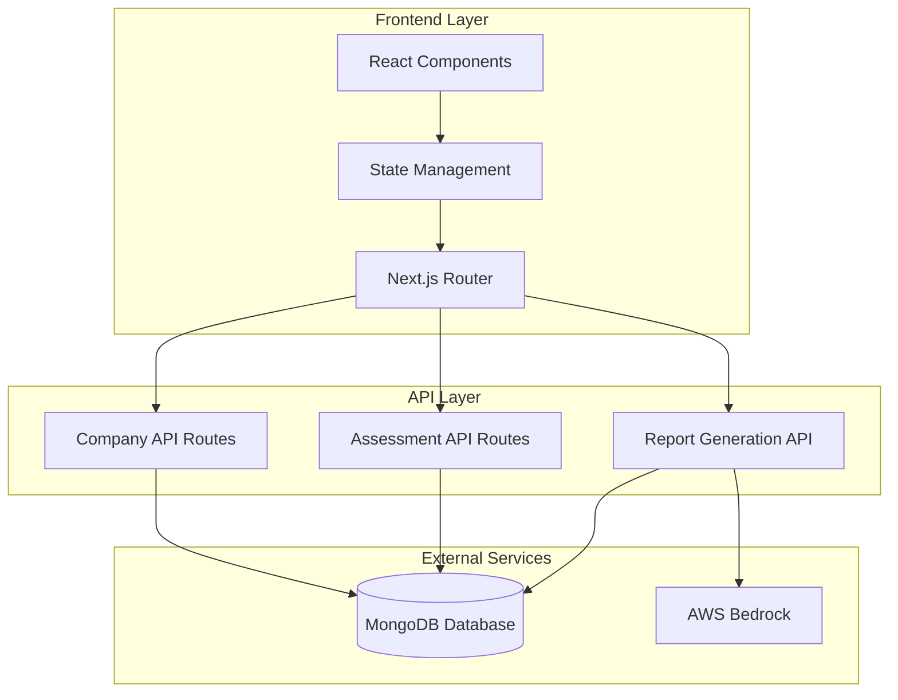
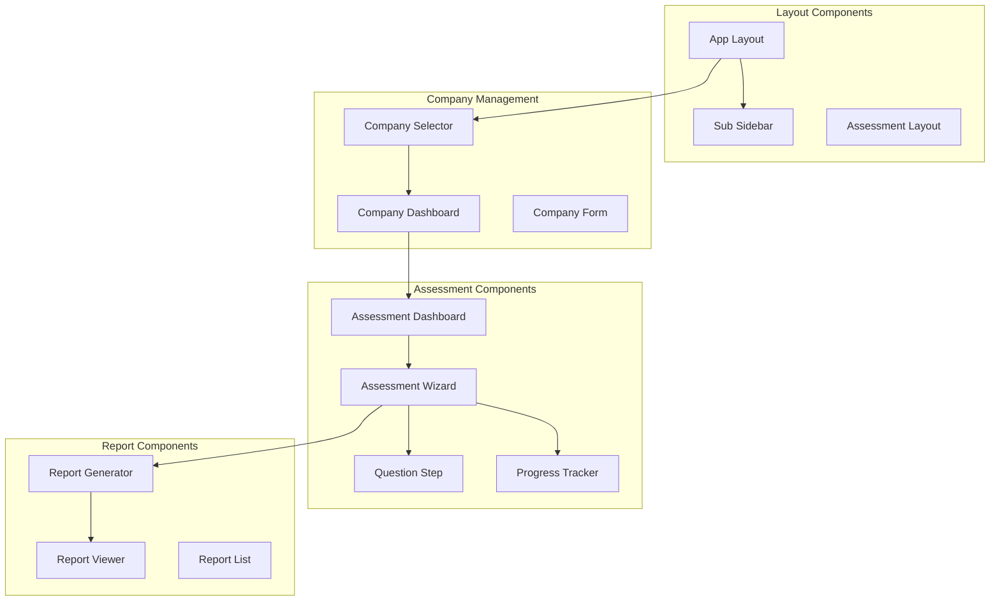

# Design Document

## Overview

AI Assessment module เป็นระบบประเมินความพร้อม GenAI ที่ออกแบบให้รองรับการทำงานแบบ multi-company และ multi-assessment โดยเน้นการพัฒนาแบบ phase-based development (UI ก่อน แล้วค่อย data persistence) เพื่อให้สามารถทดสอบ application flow ได้เร็วขึ้น

ระบบรองรับ 2 เส้นทางหลัก: Exploratory Path (7 ขั้นตอน) สำหรับการพัฒนา AI ใหม่ และ Migration Path (8 ขั้นตอน) สำหรับการ migrate AI ที่มีอยู่ โดยใช้ MongoDB เป็นฐานข้อมูลหลักและ AWS Bedrock สำหรับการสร้างรายงาน

## Architecture

### High-Level Architecture



### Component Architecture



## Components and Interfaces

### Core Components

#### 1. SubSidebar Component
```typescript
interface SubSidebarProps {
  activeModule: string
  onModuleChange: (module: string) => void
}

interface SubSidebarItem {
  id: string
  label: string
  icon: React.ComponentType
  path: string
  isActive: boolean
}
```

**Responsibilities:**
- Display navigation menu with "AI Assessment" and "Company Settings"
- Handle active state highlighting
- Responsive collapse on mobile devices

#### 2. CompanySelector Component
```typescript
interface CompanySelectorProps {
  companies: Company[]
  selectedCompany: Company | null
  onCompanySelect: (company: Company) => void
  onCreateNew: () => void
}

interface Company {
  id: string
  name: string
  description?: string
  createdAt: Date
  assessmentCount: number
}
```

**Responsibilities:**
- Display available companies in dropdown or grid format
- Handle company selection
- Redirect to Company Settings if no companies exist

#### 3. AssessmentDashboard Component
```typescript
interface AssessmentDashboardProps {
  company: Company
  assessments: Assessment[]
  onCreateAssessment: () => void
  onSelectAssessment: (assessment: Assessment) => void
  onDeleteAssessment: (assessmentId: string) => void
}

interface Assessment {
  id: string
  name: string
  companyId: string
  type: 'EXPLORATORY' | 'MIGRATION'
  status: 'DRAFT' | 'IN_PROGRESS' | 'COMPLETED'
  currentStep: number
  totalSteps: number
  createdAt: Date
  updatedAt: Date
  completedAt?: Date
}
```

**Responsibilities:**
- Display assessments for selected company
- Show assessment status and progress
- Provide CRUD operations for assessments

#### 4. AssessmentWizard Component
```typescript
interface AssessmentWizardProps {
  assessment: Assessment
  questions: QuestionSection[]
  responses: AssessmentResponses
  onResponseChange: (stepId: string, responses: any) => void
  onStepChange: (step: number) => void
  onComplete: () => void
}

interface QuestionSection {
  id: string
  title: string
  description: string
  questions: Question[]
  stepNumber: number
}

interface Question {
  id: string
  type: 'text' | 'textarea' | 'select' | 'multiselect' | 'radio' | 'checkbox' | 'number'
  label: string
  description?: string
  required: boolean
  options?: QuestionOption[]
  validation?: ValidationRules
}
```

**Responsibilities:**
- Manage multi-step questionnaire flow
- Handle form validation and error display
- Auto-save responses every 30 seconds
- Display progress indicator

#### 5. ReportGenerator Component
```typescript
interface ReportGeneratorProps {
  assessment: Assessment
  responses: AssessmentResponses
  awsCredentials: AWSCredentials
  onReportGenerated: (report: AssessmentReport) => void
}

interface AssessmentReport {
  id: string
  assessmentId: string
  companyId: string
  htmlContent: string
  generatedAt: Date
  metadata: ReportMetadata
}

interface AWSCredentials {
  accessKeyId: string
  secretAccessKey: string
  region: string
}
```

**Responsibilities:**
- Integrate with AWS Bedrock for AI-powered report generation
- Format generated content as HTML
- Store reports in MongoDB
- Handle AWS authentication errors

### Data Models

#### MongoDB Collections

##### Companies Collection
```typescript
interface CompanyDocument {
  _id: ObjectId
  name: string
  description?: string
  createdAt: Date
  updatedAt: Date
  userId: string // Owner of the company
}
```

##### Assessments Collection
```typescript
interface AssessmentDocument {
  _id: ObjectId
  name: string
  companyId: ObjectId
  userId: string
  type: 'EXPLORATORY' | 'MIGRATION'
  status: 'DRAFT' | 'IN_PROGRESS' | 'COMPLETED'
  currentStep: number
  totalSteps: number
  responses: {
    [stepId: string]: {
      [questionId: string]: any
    }
  }
  createdAt: Date
  updatedAt: Date
  completedAt?: Date
}
```

##### Reports Collection
```typescript
interface ReportDocument {
  _id: ObjectId
  assessmentId: ObjectId
  companyId: ObjectId
  userId: string
  htmlContent: string
  generatedAt: Date
  metadata: {
    assessmentType: string
    companyName: string
    generationDuration: number
    bedrockModel: string
  }
}
```

### API Interfaces

#### Company Management APIs
```typescript
// GET /api/companies
interface GetCompaniesResponse {
  companies: Company[]
  total: number
}

// POST /api/companies
interface CreateCompanyRequest {
  name: string
  description?: string
}

// PUT /api/companies/[id]
interface UpdateCompanyRequest {
  name: string
  description?: string
}
```

#### Assessment Management APIs
```typescript
// GET /api/assessments?companyId=xxx
interface GetAssessmentsResponse {
  assessments: Assessment[]
  total: number
}

// POST /api/assessments
interface CreateAssessmentRequest {
  name: string
  companyId: string
  type: 'EXPLORATORY' | 'MIGRATION'
}

// PUT /api/assessments/[id]/responses
interface SaveResponsesRequest {
  stepId: string
  responses: { [questionId: string]: any }
  currentStep: number
}
```

#### Report Generation APIs
```typescript
// POST /api/reports/generate
interface GenerateReportRequest {
  assessmentId: string
  awsCredentials: AWSCredentials
}

// GET /api/reports/[id]
interface GetReportResponse {
  report: AssessmentReport
}
```

## Phase-Based Development Strategy

### Phase 1: UI/UX Foundation (Week 1-2)
**Goal:** Create complete UI flow with mock data for rapid testing

**Components to Build:**
- SubSidebar with navigation
- CompanySelector with mock companies
- AssessmentDashboard with mock assessments
- AssessmentWizard with all question types
- ProgressTracker and navigation
- ReportViewer with sample HTML content

**Mock Data Strategy:**
- Use static JSON files for companies and assessments
- Implement localStorage for temporary data persistence
- Create sample questionnaire structure
- Generate sample HTML reports

**Benefits:**
- Rapid prototyping and user testing
- Early feedback on UX flow
- Component isolation and testing
- Visual validation of responsive design

### Phase 2: Data Integration (Week 3-4)
**Goal:** Replace mock data with MongoDB integration

**Implementation Steps:**
- Set up MongoDB connection and schemas
- Implement API routes for CRUD operations
- Replace localStorage with API calls
- Add proper error handling and loading states
- Implement auto-save functionality

### Phase 3: AWS Bedrock Integration (Week 5)
**Goal:** Add AI-powered report generation

**Implementation Steps:**
- Integrate AWS SDK for Bedrock
- Implement report generation logic
- Add AWS credentials management
- Create HTML report templates
- Test with different Bedrock models

### Phase 4: Polish and Optimization (Week 6)
**Goal:** Performance optimization and final touches

**Implementation Steps:**
- Add caching strategies
- Optimize database queries
- Implement proper error boundaries
- Add comprehensive validation
- Performance testing and optimization

## Correctness Properties

*A property is a characteristic or behavior that should hold true across all valid executions of a system-essentially, a formal statement about what the system should do. Properties serve as the bridge between human-readable specifications and machine-verifiable correctness guarantees.*

### Property 1: Sub-sidebar active state consistency
*For any* assessment-related page navigation, the sub-sidebar should highlight the "AI Assessment" menu item when the user is on any assessment page
**Validates: Requirements 1.3**

### Property 2: Company-based assessment filtering
*For any* company selection, all displayed assessments should belong only to the selected company and no assessments from other companies should appear
**Validates: Requirements 2.2**

### Property 3: Assessment creation with company association
*For any* valid assessment creation request with company selection, the created assessment should be properly associated with the selected company and contain all required fields (name, company ID, path type)
**Validates: Requirements 2.4, 2.5, 3.5**

### Property 4: Company name display consistency
*For any* assessment interface, the displayed company name in the header should match the company associated with the current assessment
**Validates: Requirements 2.6**

### Property 5: Step progression and validation
*For any* assessment step with required fields, progression to the next step should only be enabled when all required fields are valid and complete
**Validates: Requirements 4.2, 4.4**

### Property 6: Progress indicator accuracy
*For any* assessment step navigation, the progress indicator should accurately reflect the current step number and total steps for the assessment type
**Validates: Requirements 4.1**

### Property 7: Response preservation during navigation
*For any* step navigation within an assessment, previously entered responses should be preserved and restored when returning to that step
**Validates: Requirements 4.3**

### Property 8: Assessment state persistence
*For any* assessment that is saved and later restored, all responses and the current step position should be identical to when it was last saved
**Validates: Requirements 5.3**

### Property 9: Navigation-triggered save
*For any* step navigation event, the current responses should be immediately saved to the database before navigation occurs
**Validates: Requirements 5.2**

### Property 10: Assessment-company relationship integrity
*For any* created assessment, it should be associated with exactly one company ID and this relationship should be maintained throughout the assessment lifecycle
**Validates: Requirements 5.5**

### Property 11: AWS credentials validation and error handling
*For any* invalid or missing AWS credentials, the system should display appropriate error messages and disable report generation functionality
**Validates: Requirements 6.4**

### Property 12: Report generation availability
*For any* completed assessment, report generation functionality should be enabled and available to the user
**Validates: Requirements 7.1**

### Property 13: HTML report structure and storage
*For any* generated report, it should be formatted as valid HTML with proper structure and stored in MongoDB with unique ID, timestamp, and proper associations
**Validates: Requirements 7.3, 7.4, 7.5, 7.7**

### Property 14: Report viewing functionality
*For any* stored report, users should be able to view the report in a formatted display that renders the HTML content correctly
**Validates: Requirements 7.6**

## Error Handling

### Input Validation Strategy
- **Client-side validation**: Immediate feedback for user input errors
- **Server-side validation**: Comprehensive validation before data persistence
- **Schema validation**: MongoDB schema enforcement for data integrity
- **AWS credential validation**: Real-time validation of Bedrock connectivity

### Error Recovery Mechanisms
- **Auto-save recovery**: Restore unsaved responses from localStorage on page reload
- **Network error handling**: Retry mechanisms for failed API calls
- **Graceful degradation**: Disable features when dependencies are unavailable
- **User-friendly messages**: Clear error messages with suggested actions

### Error Boundary Implementation
```typescript
interface ErrorBoundaryState {
  hasError: boolean
  errorMessage: string
  errorCode?: string
}

class AssessmentErrorBoundary extends React.Component<Props, ErrorBoundaryState> {
  // Handle component errors gracefully
  // Provide fallback UI for critical failures
  // Log errors for debugging
}
```

## Testing Strategy

### Dual Testing Approach
The testing strategy combines unit tests for specific examples and edge cases with property-based tests for universal properties across all inputs. Both approaches are complementary and necessary for comprehensive coverage.

**Unit Tests Focus:**
- Specific UI component behavior
- API endpoint functionality
- Error condition handling
- Integration between components
- Edge cases like empty data states

**Property-Based Tests Focus:**
- Universal properties that hold across all valid inputs
- Data consistency and integrity
- State management correctness
- Navigation and flow validation

### Property-Based Testing Configuration
- **Testing Library**: fast-check for TypeScript/JavaScript property-based testing
- **Test Iterations**: Minimum 100 iterations per property test
- **Test Tagging**: Each property test tagged with format: **Feature: ai-assessment, Property {number}: {property_text}**
- **Coverage**: Each correctness property implemented as a single property-based test

### Testing Implementation Guidelines
- Property tests validate universal behaviors across randomized inputs
- Unit tests verify specific examples and integration points
- Mock external dependencies (AWS Bedrock) for consistent testing
- Use test databases for data persistence testing
- Implement visual regression testing for UI components

### Test Data Generation Strategy
- **Companies**: Generate random company names, descriptions, and IDs
- **Assessments**: Create assessments with various states, steps, and response patterns
- **Responses**: Generate valid and invalid response data for all question types
- **Reports**: Create sample HTML reports with different structures and content

This comprehensive testing approach ensures both the correctness of individual components and the overall system behavior across all possible inputs and states.