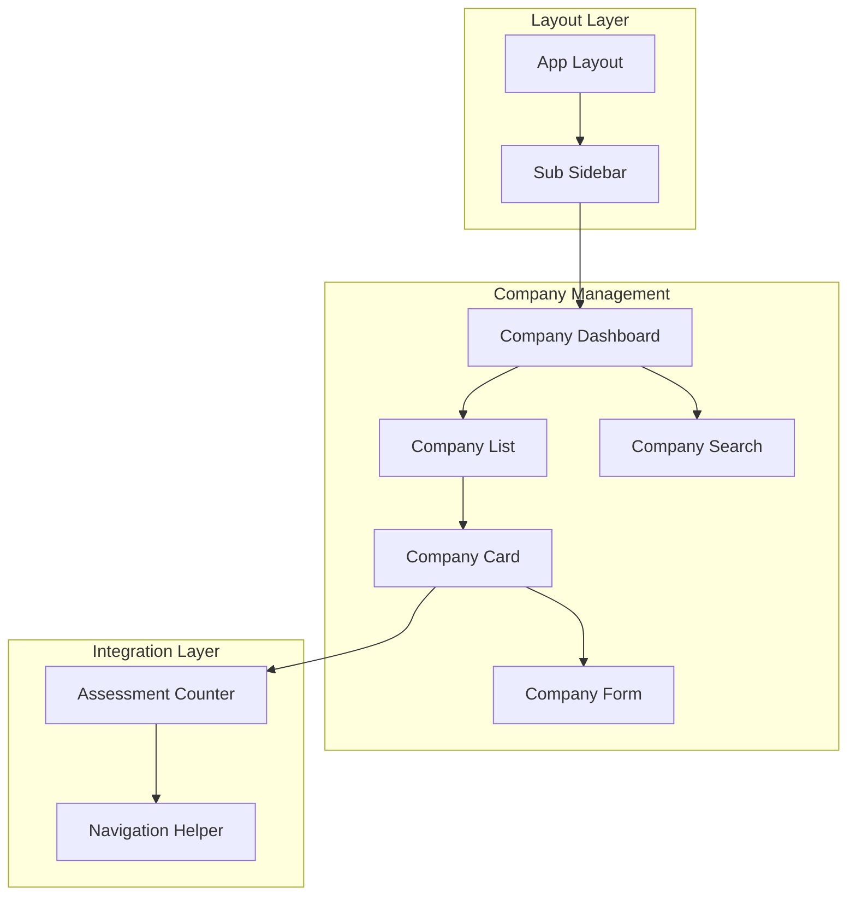
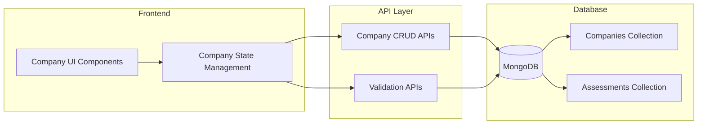

# Design Document

## Overview

Company Settings module เป็นระบบจัดการข้อมูลบริษัทที่ออกแบบให้ทำงานร่วมกับ AI Assessment module โดยให้ผู้ใช้สามารถสร้าง แก้ไข และลบข้อมูลบริษัทได้ พร้อมทั้งแสดงจำนวน assessments ที่เกี่ยวข้องกับแต่ละบริษัท

ระบบออกแบบให้รองรับการพัฒนาแบบ phase-based โดยเน้น UI/UX ก่อน แล้วค่อยเพิ่ม data persistence ใน MongoDB ในภายหลัง

## Architecture

### Component Architecture



### Data Flow Architecture



## Components and Interfaces

### Core Components

#### 1. CompanyDashboard Component
```typescript
interface CompanyDashboardProps {
  companies: Company[]
  loading: boolean
  error?: string
  onCreateCompany: () => void
  onEditCompany: (company: Company) => void
  onDeleteCompany: (companyId: string) => void
  onSearchCompanies: (query: string) => void
}

interface Company {
  id: string
  name: string
  description?: string
  createdAt: Date
  updatedAt: Date
  assessmentCount: number
}
```

**Responsibilities:**
- Display company list with search functionality
- Handle company CRUD operations
- Show assessment counts for each company
- Provide navigation to AI Assessment module

#### 2. CompanyForm Component
```typescript
interface CompanyFormProps {
  company?: Company // undefined for create, defined for edit
  onSubmit: (companyData: CompanyFormData) => void
  onCancel: () => void
  loading: boolean
  errors?: FormErrors
}

interface CompanyFormData {
  name: string
  description?: string
}

interface FormErrors {
  name?: string
  description?: string
  general?: string
}
```

**Responsibilities:**
- Handle company creation and editing forms
- Provide real-time validation feedback
- Display error messages and loading states
- Support both create and edit modes

#### 3. CompanyCard Component
```typescript
interface CompanyCardProps {
  company: Company
  onEdit: (company: Company) => void
  onDelete: (companyId: string) => void
  onViewAssessments: (companyId: string) => void
}
```

**Responsibilities:**
- Display individual company information
- Show assessment count with clickable link
- Provide edit and delete actions
- Handle responsive layout for different screen sizes

#### 4. CompanySearch Component
```typescript
interface CompanySearchProps {
  onSearch: (query: string) => void
  placeholder?: string
  debounceMs?: number
}
```

**Responsibilities:**
- Provide search input with debouncing
- Filter companies by name
- Clear search functionality
- Responsive design for mobile devices

### Data Models

#### MongoDB Collections

##### Companies Collection
```typescript
interface CompanyDocument {
  _id: ObjectId
  name: string
  description?: string
  createdAt: Date
  updatedAt: Date
  userId: string // Owner of the company
}

// Indexes
// { userId: 1, name: 1 } - for user-specific company queries
// { name: "text" } - for text search functionality
```

##### Assessment Count Aggregation
```typescript
interface CompanyWithAssessmentCount {
  _id: ObjectId
  name: string
  description?: string
  createdAt: Date
  updatedAt: Date
  userId: string
  assessmentCount: number
}

// Aggregation pipeline to join with assessments collection
const getCompaniesWithAssessmentCount = [
  { $match: { userId: currentUserId } },
  {
    $lookup: {
      from: "assessments",
      localField: "_id",
      foreignField: "companyId",
      as: "assessments"
    }
  },
  {
    $addFields: {
      assessmentCount: { $size: "$assessments" }
    }
  },
  { $project: { assessments: 0 } }
]
```

### API Interfaces

#### Company Management APIs
```typescript
// GET /api/companies
interface GetCompaniesResponse {
  companies: CompanyWithAssessmentCount[]
  total: number
}

// POST /api/companies
interface CreateCompanyRequest {
  name: string
  description?: string
}

interface CreateCompanyResponse {
  company: Company
  message: string
}

// PUT /api/companies/[id]
interface UpdateCompanyRequest {
  name: string
  description?: string
}

interface UpdateCompanyResponse {
  company: Company
  message: string
}

// DELETE /api/companies/[id]
interface DeleteCompanyResponse {
  message: string
  deletedAssessments: number
}

// GET /api/companies/search?q=query
interface SearchCompaniesResponse {
  companies: CompanyWithAssessmentCount[]
  total: number
  query: string
}
```

### Validation Rules

#### Company Name Validation
```typescript
interface CompanyNameValidation {
  minLength: 2
  maxLength: 100
  required: true
  pattern: /^[a-zA-Z0-9\s\-_&.()]+$/ // Allow common business characters
  uniquePerUser: true // Unique within user's companies
}
```

#### Company Description Validation
```typescript
interface CompanyDescriptionValidation {
  maxLength: 500
  required: false
  allowEmpty: true
}
```

## Phase-Based Development Strategy

### Phase 1: UI Components with Mock Data (Week 1)
**Goal:** Create complete UI experience with static data

**Components to Build:**
- CompanyDashboard with mock company list
- CompanyForm for create/edit operations
- CompanyCard with sample data
- CompanySearch with client-side filtering
- Responsive layout for all screen sizes

**Mock Data Strategy:**
- Use static JSON with sample companies
- Implement localStorage for temporary persistence
- Mock assessment counts with random numbers
- Create sample validation scenarios

**Benefits:**
- Rapid UI development and testing
- Early UX validation and feedback
- Component isolation and testing
- Visual design validation

### Phase 2: Form Validation and State Management (Week 2)
**Goal:** Implement comprehensive form handling and validation

**Implementation Steps:**
- Add real-time form validation
- Implement proper error handling
- Add loading states and feedback
- Create form submission workflows
- Add confirmation dialogs for destructive actions

### Phase 3: MongoDB Integration (Week 3)
**Goal:** Replace mock data with database operations

**Implementation Steps:**
- Set up MongoDB schemas and indexes
- Implement API routes for CRUD operations
- Add proper error handling for database operations
- Implement search functionality with MongoDB text search
- Add data consistency checks

### Phase 4: AI Assessment Integration (Week 4)
**Goal:** Complete integration with AI Assessment module

**Implementation Steps:**
- Implement assessment count aggregation
- Add navigation links to AI Assessment module
- Handle company deletion with assessment cleanup
- Add data synchronization between modules
- Implement proper error handling for cross-module operations

## Correctness Properties

*A property is a characteristic or behavior that should hold true across all valid executions of a system-essentially, a formal statement about what the system should do. Properties serve as the bridge between human-readable specifications and machine-verifiable correctness guarantees.*

### Property 1: Company name uniqueness per user
*For any* user, no two companies should have the same name within that user's company list
**Validates: Requirements 7.4**

### Property 2: Company CRUD operations consistency
*For any* valid company creation, the created company should appear in the company list with all provided information intact
**Validates: Requirements 2.5, 2.6, 2.7**

### Property 3: Company update preservation
*For any* company update operation, all unchanged fields should remain identical while only modified fields should reflect the new values
**Validates: Requirements 4.5, 4.7**

### Property 4: Assessment count accuracy
*For any* company displayed in the list, the assessment count should exactly match the number of assessments associated with that company in the database
**Validates: Requirements 3.3, 6.3**

### Property 5: Search functionality correctness
*For any* search query, all returned companies should contain the search term in their name, and no companies containing the search term should be excluded
**Validates: Requirements 3.5**

### Property 6: Company deletion cascade
*For any* company deletion, all assessments associated with that company should also be removed from the database
**Validates: Requirements 5.5**

### Property 7: Form validation consistency
*For any* invalid company data submission, the form should prevent submission and display appropriate error messages for all invalid fields
**Validates: Requirements 7.1, 7.2, 7.3**

### Property 8: Navigation integration correctness
*For any* company with assessments, clicking the assessment count should navigate to the AI Assessment module with that company pre-selected
**Validates: Requirements 6.4**

### Property 9: Responsive layout preservation
*For any* screen size change, all company information should remain accessible and readable without loss of functionality
**Validates: Requirements 8.1, 8.2, 8.3, 8.5**

### Property 10: Data persistence round-trip
*For any* company data that is saved and then retrieved, the retrieved data should be identical to what was originally saved
**Validates: Requirements 9.1, 9.4**

## Error Handling

### Validation Error Strategy
- **Real-time validation**: Immediate feedback as users type
- **Server-side validation**: Comprehensive validation before database operations
- **Duplicate name detection**: Check for existing company names per user
- **Network error handling**: Graceful handling of connectivity issues

### User Experience Error Handling
- **Loading states**: Clear indicators during operations
- **Error messages**: Specific, actionable error descriptions
- **Recovery suggestions**: Help users resolve validation errors
- **Confirmation dialogs**: Prevent accidental destructive operations

### Data Consistency Error Handling
- **Transaction rollback**: Ensure data consistency during failures
- **Optimistic updates**: Immediate UI feedback with rollback on failure
- **Conflict resolution**: Handle concurrent modifications gracefully
- **Audit logging**: Track all company operations for debugging

## Testing Strategy

### Dual Testing Approach
The testing strategy combines unit tests for specific component behavior with property-based tests for universal system properties. Both approaches ensure comprehensive coverage of functionality and edge cases.

**Unit Tests Focus:**
- Component rendering and interaction
- Form validation scenarios
- API endpoint functionality
- Error condition handling
- Responsive design behavior

**Property-Based Tests Focus:**
- Data consistency across operations
- Search functionality correctness
- CRUD operation integrity
- Cross-module integration behavior

### Property-Based Testing Configuration
- **Testing Library**: fast-check for TypeScript property-based testing
- **Test Iterations**: Minimum 100 iterations per property test
- **Test Tagging**: Format: **Feature: company-settings, Property {number}: {property_text}**
- **Mock Strategy**: Mock external dependencies while testing core logic

### Test Data Generation
- **Company Names**: Generate valid and invalid company names
- **Descriptions**: Create various description lengths and content
- **User Scenarios**: Test with different user contexts and permissions
- **Assessment Data**: Generate related assessment data for integration testing