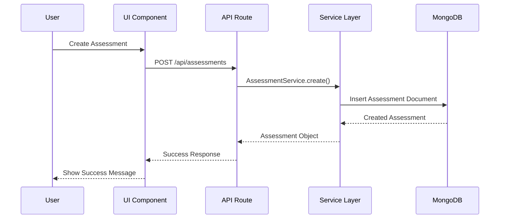
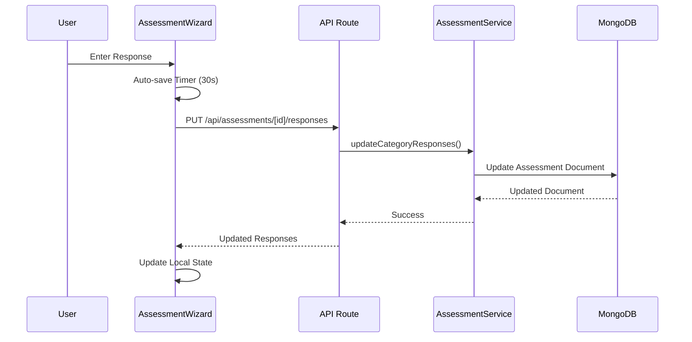
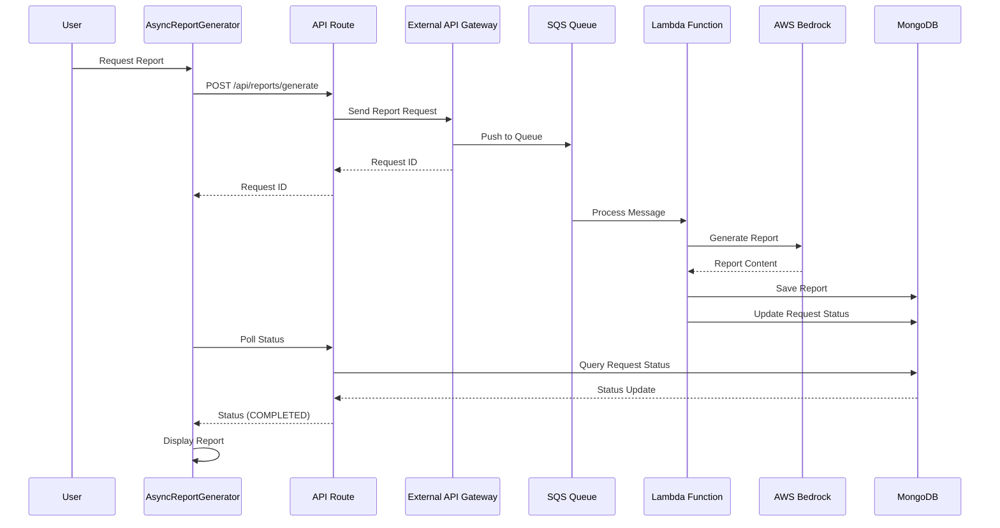

# Architecture Documentation - RAPID AI Assessment Platform

## Overview

The RAPID AI Assessment Platform is a comprehensive Next.js 14+ application built with TypeScript that enables organizations to assess their GenAI readiness through structured questionnaires. The platform follows a modular architecture with clear separation of concerns, making it maintainable, testable, and extensible.

## System Architecture

### High-Level Architecture

```
┌─────────────────────────────────────────────────────────────────┐
│                      Application Layer                          │
├─────────────────────────────────────────────────────────────────┤
│  Next.js Pages  │  React Components  │  Custom Hooks         │
│  (App Router)    │  (UI Components)    │  (Business Logic)     │
├─────────────────────────────────────────────────────────────────┤
│                      Framework Layer                            │
├─────────────────────────────────────────────────────────────────┤
│  Auth Context   │  Route Guards     │  Layout Components      │
│  State Mgmt     │  Navigation       │  Error Boundaries       │
├─────────────────────────────────────────────────────────────────┤
│                        Core Layer                               │
├─────────────────────────────────────────────────────────────────┤
│  Config Manager │  Provider Registry │  Validation             │
│  API Client     │  Services         │  Utilities              │
├─────────────────────────────────────────────────────────────────┤
│                    Infrastructure Layer                         │
├─────────────────────────────────────────────────────────────────┤
│  MongoDB        │  External API     │  AWS Services           │
│  Local Storage  │  Environment      │  File System            │
└─────────────────────────────────────────────────────────────────┘
```

### Core Principles

1. **Separation of Concerns**: Each module has a single, well-defined responsibility
2. **Dependency Inversion**: High-level modules don't depend on low-level modules
3. **Interface Segregation**: Clients depend only on interfaces they use
4. **Plugin Architecture**: Extensible through provider registration
5. **Configuration-Driven**: Behavior controlled by environment variables
6. **Type Safety**: Comprehensive TypeScript typing throughout
7. **Testability**: Each module can be tested independently

## Module Architecture

### 1. Authentication Module 🔐

**Purpose**: Configurable authentication framework with environment-based control

**Location**: `src/contexts/`, `src/lib/config.ts`, `src/lib/AuthProviderRegistry.ts`

**Key Components**:
- `AuthContext`: React context for authentication state and operations
- `AuthProvider`: Context provider component
- `AuthWrapper`: Wrapper that always provides AuthProvider
- `ConfigManager`: Environment-based configuration management
- `AuthProviderRegistry`: Plugin system for authentication providers
- `RouteGuard`: Route protection component with `withRouteGuard` HOC
- `LoginPage`: Login form component
- `LoginPageContainer`: Container connecting LoginPage with auth logic

**Architecture Pattern**: Registry Pattern, Strategy Pattern

---

### 2. AI Assessment Module 📊

**Purpose**: Core assessment functionality with RAPID questionnaire integration

**Location**: `src/components/ai-assessment/`, `src/app/ai-assessment/`

**Key Components**:
- `AssessmentContainer`: Main container managing assessment flow and view modes
- `AssessmentDashboard`: Assessment list and management
- `DatabaseIntegratedAssessmentWizard`: Primary wizard component with RAPID integration
- `EnhancedCategoryNavigationWithSubcategories`: Category navigation with subcategory support
- `FixedQuestionContainer`: Consistent UI container with fixed dimensions
- `EnhancedRAPIDQuestionnaireLoader`: Enhanced loader with database integration and caching
- `ResponseReviewModal`: Comprehensive response review
- `AssessmentViewer`: Read-only assessment viewer (uses `useAssessmentViewer` hook)
- `ReportGenerator`: Report generation component
- `AsyncReportGenerator`: Asynchronous report generation
- `ReportStatusTracker`: Tracks report generation status

**Data Flow**:
```
User → Company Selection → Assessment Creation → 
Questionnaire Loading → Category Navigation → 
Response Entry (Auto-save) → Review → Completion → 
Report Generation
```

**Architecture Pattern**: Component Composition, State Management

---

### 3. Company Settings Module 🏢

**Purpose**: Company management and organization

**Location**: `src/components/company-settings/`, `src/app/company-settings/`

**Key Components**:
- `CompanyContainer`: Main container for company management (no props, self-contained)
- `CompanyDashboard`: Company list with search and integrated form modal
- `CompanyForm`: Create/edit company form with duplicate checking
- `CompanyCard`: Individual company display with navigation
- `CompanySearch`: Client-side search functionality with debouncing
- `CompanyErrorBoundary`: Error boundary for graceful error handling
- `Tooltip`: Reusable tooltip component

**Data Flow**:
```
User → Company List → Create/Edit/Delete → 
Validation → API Call → Database Update → 
UI Refresh
```

**Architecture Pattern**: CRUD Pattern, Form Management

---

### 4. Report Generation Module 📄

**Purpose**: Asynchronous report generation via External API Gateway

**Location**: `src/components/ai-assessment/AsyncReportGenerator.tsx`, `src/app/api/reports/`

**Key Components**:
- `AsyncReportGenerator`: Initiates report generation
- `ReportStatusTracker`: Tracks report generation status
- `ReportViewer`: Displays generated reports

**Data Flow**:
```
User → Request Report → External API Gateway → 
SQS Queue → Lambda Function → AWS Bedrock → 
Report Generation → MongoDB Update → Status Polling → 
Report Display
```

**Architecture Pattern**: Asynchronous Processing, Polling Pattern

---

### 5. API Layer 🌐

**Purpose**: Serverless API routes for all operations

**Location**: `src/app/api/`

**Structure**:
```
api/
├── assessments/        # Assessment CRUD operations
│   ├── route.ts                    # GET, POST
│   └── [id]/
│       ├── route.ts                # GET, PUT, DELETE
│       ├── responses/route.ts      # GET, PUT, PATCH
│       ├── review/route.ts         # GET
│       └── validate/route.ts       # GET, POST, PUT, DELETE
├── companies/          # Company CRUD operations
│   ├── route.ts                    # GET, POST
│   ├── [id]/route.ts              # GET, PUT, DELETE
│   └── search/route.ts            # GET
├── questionnaires/     # Questionnaire endpoints
│   ├── route.ts                    # GET (legacy)
│   └── rapid/
│       ├── route.ts                # GET, POST
│       └── init/route.ts          # GET, POST
├── reports/            # Report generation endpoints
│   ├── route.ts                    # GET, POST
│   ├── generate/route.ts          # POST
│   └── [id]/route.ts              # GET
├── aws/                # AWS integration endpoints
│   ├── test-bedrock/route.ts      # POST
│   └── credentials/route.ts      # POST
└── db/                 # Database initialization
    └── init/route.ts              # GET, POST
```

**Architecture Pattern**: RESTful API, Serverless Functions

---

### 6. Data Layer 💾

**Purpose**: Data persistence and management

**Location**: `src/lib/mongodb.ts`, `src/lib/models/`, `src/lib/services/`

**Key Components**:
- `MongoDB Connection`: Database connection management (`mongodb.ts`)
- `Data Models`: TypeScript interfaces and model classes for MongoDB documents
  - `AssessmentModel` / `AssessmentDocument`: Assessment data model
  - `CompanyModel` / `CompanyDocument`: Company data model
  - `ReportModel` / `ReportDocument`: Report data model
- `Services`: Business logic layer for data operations
  - `AssessmentService`: Assessment CRUD and category-based operations
  - `RAPIDQuestionnaireService`: RAPID questionnaire loading and management
  - `validation-service`: Assessment validation logic
  - `rapid-questionnaire-init`: RAPID questionnaire initialization

**Collections** (defined in `COLLECTIONS` constant):
- `companies`: Company information
- `assessments`: Assessment data with category-based responses
- `rapid_questionnaires`: RAPID questionnaire structure
- `reports`: Generated assessment reports
- `report_requests`: Asynchronous report generation requests

**Collection Access**:
- Collections accessed via `getCollection(COLLECTIONS.COLLECTION_NAME)`
- Models use static methods for data access (Repository Pattern)
- All queries filtered by `userId` for data isolation

**Architecture Pattern**: Repository Pattern, Service Layer

## Design Patterns

### 1. Registry Pattern

Used for managing authentication providers and hooks:

```typescript
class AuthProviderRegistry {
  private providers: Map<string, IAuthProvider> = new Map();
  
  register(provider: IAuthProvider): void;
  authenticate(credentials: LoginCredentials): Promise<AuthResult>;
}
```

### 2. Strategy Pattern

Different authentication strategies through providers:

```typescript
// OAuth Provider
class OAuthProvider implements IAuthProvider {
  async authenticate(credentials) {
    // OAuth implementation
  }
}

// LDAP Provider  
class LDAPProvider implements IAuthProvider {
  async authenticate(credentials) {
    // LDAP implementation
  }
}
```

### 3. Observer Pattern

Hook system for authentication events and assessment lifecycle:

```typescript
interface IAuthHook {
  beforeAuthenticate?(credentials: LoginCredentials): Promise<LoginCredentials | null>;
  afterAuthenticate?(user: User, session: Session): Promise<void>;
}
```

### 4. Factory Pattern

Configuration factory based on environment:

```typescript
class ConfigManager {
  static getAuthConfig(): AuthConfig {
    return {
      authEnabled: this.parseAuthEnabled(),
      sessionTimeout: this.parseSessionTimeout(),
      rememberSidebar: this.parseRememberSidebar(),
      defaultRoute: this.parseDefaultRoute(),
    };
  }
}
```

### 5. Component Composition Pattern

Building complex UIs from smaller components:

```typescript
<AssessmentContainer>
  <CompanySelector />
  <AssessmentDashboard>
    <AssessmentWizard>
      <CategoryNavigationSidebar />
      <FixedQuestionContainer>
        <QuestionStep />
      </FixedQuestionContainer>
    </AssessmentWizard>
  </AssessmentDashboard>
</AssessmentContainer>
```

### 6. Repository Pattern

Data access abstraction through Model classes:

```typescript
// Model classes provide data access
class AssessmentService {
  async getAssessment(id: string): Promise<Assessment | null>;
  async createAssessment(data: CreateAssessmentRequest): Promise<Assessment>;
  async updateCategoryResponses(id: string, categoryId: string, responses: any): Promise<void>;
  async updateCategoryStatus(id: string, categoryId: string, status: CategoryCompletionStatus): Promise<void>;
  async getAssessmentStatistics(id: string): Promise<AssessmentStatistics>;
}

class CompanyModel {
  static async findAll(userId: string): Promise<Company[]>;
  static async findById(id: string, userId: string): Promise<Company | null>;
  static async create(data: CreateCompanyRequest, userId: string): Promise<Company>;
  static async update(id: string, userId: string, data: UpdateCompanyRequest): Promise<Company>;
  static async delete(id: string, userId: string): Promise<boolean>;
  static async search(query: string, userId: string): Promise<Company[]>;
  static async getAssessmentCount(id: string, userId: string): Promise<number>;
}

class RAPIDQuestionnaireService {
  static async getActiveQuestionnaire(type: AssessmentType): Promise<RAPIDQuestionnaireStructure | null>;
  static async getQuestionnaireByVersion(version: string, type: AssessmentType): Promise<RAPIDQuestionnaireStructure | null>;
  static async storeQuestionnaire(questionnaire: RAPIDQuestionnaireStructure): Promise<{ success: boolean; id?: string }>;
  static async listVersions(): Promise<string[]>;
}
```

## Data Flow Architecture

### Assessment Creation Flow



### Response Saving Flow



### Report Generation Flow



## State Management

### Client-Side State

**React Context**:
- `AuthContext`: Authentication state
- Component-level state for UI interactions

**Local Storage**:
- Session data
- User preferences
- Sidebar state (if enabled)

**Server State**:
- Assessment data (fetched from API)
- Company data (fetched from API)
- Questionnaire structure (cached)

### State Synchronization

- **Optimistic Updates**: Immediate UI feedback
- **Auto-save**: Background synchronization every 30 seconds
- **Real-time Updates**: Polling for report status
- **Error Recovery**: Retry mechanism for failed operations

## API Architecture

### RESTful Design

- **Resources**: Assessments, Companies, Reports, Questionnaires
- **HTTP Methods**: GET, POST, PUT, DELETE, PATCH
- **Status Codes**: Standard HTTP status codes
- **Error Handling**: Consistent error response format

### API Structure

```
/api
├── assessments/
│   ├── GET /                    # List assessments
│   ├── POST /                   # Create assessment
│   ├── GET /[id]                # Get assessment with statistics
│   ├── PUT /[id]                # Update assessment (currentCategory, currentSubcategory)
│   ├── DELETE /[id]             # Delete assessment
│   ├── GET /[id]/responses      # Get responses
│   ├── PUT /[id]/responses      # Save category-based responses
│   ├── PATCH /[id]/responses    # Complete assessment (action: 'complete')
│   ├── GET /[id]/review         # Get review data
│   └── GET /[id]/validate       # Get validation summary
│   └── POST /[id]/validate      # Validate specific responses/categories
│   └── PUT /[id]/validate       # Save validated responses
│   └── DELETE /[id]/validate    # Clear validation cache
├── companies/
│   ├── GET /                    # List companies
│   ├── POST /                   # Create company
│   ├── GET /[id]                # Get company with assessment count
│   ├── PUT /[id]                # Update company
│   ├── DELETE /[id]             # Delete company (cascade deletion)
│   └── GET /search?q=query      # Search companies
├── questionnaires/
│   ├── GET /                    # Get questionnaire sections (legacy)
│   ├── GET /rapid               # Get RAPID questionnaire
│   ├── POST /rapid              # Store RAPID questionnaire
│   ├── GET /rapid/init          # Check initialization status
│   └── POST /rapid/init         # Initialize RAPID questionnaires
└── reports/
    ├── GET /                    # List reports
    ├── POST /                   # Create report request
    ├── POST /generate           # Generate report (synchronous)
    └── GET /[id]                # Get report
```

## Database Architecture

### MongoDB Collections

#### Companies Collection
```typescript
{
  _id: ObjectId,
  name: string,
  description?: string,
  createdAt: Date,
  updatedAt: Date,
  userId: string
}
```

**Indexes**:
- `{ userId: 1 }` - User-specific queries
- `{ userId: 1, createdAt: -1 }` - User queries sorted by creation date
- `{ userId: 1, name: 1 }` - User-specific company name queries (for uniqueness)
- Text search indexes for name and description fields

#### Assessments Collection
```typescript
{
  _id: ObjectId,
  name: string,
  companyId: ObjectId,
  userId: string,
  type: 'EXPLORATORY' | 'MIGRATION',
  status: 'DRAFT' | 'IN_PROGRESS' | 'COMPLETED',
  currentCategory: string,
  currentSubcategory?: string,
  totalCategories: number,
  responses: {
    [categoryId: string]: {
      [questionId: string]: any
    }
  },
  categoryStatuses: {
    [categoryId: string]: {
      categoryId: string,
      status: 'not_started' | 'partial' | 'completed',
      completionPercentage: number,
      lastModified: Date,
      requiredQuestionsCount: number,
      answeredRequiredCount: number,
      totalQuestionsCount: number,
      answeredTotalCount: number
    }
  },
  rapidQuestionnaireVersion: string,
  // Legacy fields (for backward compatibility)
  currentStep?: number,
  totalSteps?: number,
  stepStatuses?: {
    [stepNumber: number]: {
      status: 'not_started' | 'partial' | 'completed',
      lastModified: Date,
      requiredFieldsCount: number,
      filledFieldsCount: number
    }
  },
  createdAt: Date,
  updatedAt: Date,
  completedAt?: Date
}
```

**Indexes**:
- `{ companyId: 1, userId: 1 }` - Company and user queries
- `{ userId: 1, status: 1 }` - User status queries
- `{ createdAt: -1 }` - Creation date sorting
- `{ updatedAt: -1 }` - Update date sorting
- `{ rapidQuestionnaireVersion: 1, type: 1 }` - RAPID version and type queries
- `{ currentCategory: 1, status: 1 }` - Current category and status queries
- `{ userId: 1, type: 1, status: 1 }` - User, type, and status queries
- `{ 'categoryStatuses.status': 1 }` - Category status queries

#### RAPID Questionnaires Collection
```typescript
{
  _id: ObjectId,
  version: string,
  assessmentType: 'EXPLORATORY' | 'MIGRATION',
  totalQuestions: number,
  categories: {
    id: string,
    title: string,
    description?: string,
    subcategories: {
      id: string,
      title: string,
      questions: {
        id: string,
        number: string,
        text: string,
        description?: string,
        type: 'text' | 'textarea' | 'select' | 'radio' | 'checkbox' | 'number',
        required: boolean,
        options?: string[],
        category: string,
        subcategory: string
      }[],
      questionCount: number
    }[],
    totalQuestions: number
  }[],
  isActive: boolean,
  createdAt: Date,
  updatedAt: Date
}
```

**Indexes**:
- `{ version: 1, assessmentType: 1 }` - Unique index for version and type
- `{ isActive: 1, assessmentType: 1 }` - Active questionnaire queries
- `{ createdAt: -1 }` - Creation date sorting
- `{ 'categories.id': 1 }` - Category ID queries
- `{ 'categories.subcategories.questions.id': 1 }` - Question ID queries

## Security Architecture

### Authentication & Authorization

- **Configurable Authentication**: Environment-based control
- **Session Management**: Secure session handling with expiration
- **Route Protection**: Client and server-side protection
- **User Isolation**: All queries filtered by userId

### Data Security

- **Input Validation**: Client and server-side validation
- **Type Safety**: TypeScript for compile-time safety
- **Error Handling**: Secure error messages (no sensitive data)
- **HTTPS**: Required in production

### API Security

- **Authentication**: Required for protected endpoints
- **Authorization**: User-based data access
- **Rate Limiting**: Protection against abuse
- **Input Sanitization**: All inputs sanitized

## Performance Architecture

### Optimization Strategies

1. **Code Splitting**: Dynamic imports for large components
2. **Lazy Loading**: Load questionnaire data on demand
3. **Caching**: Cache questionnaire structure and company list
4. **Debouncing**: Debounce search and auto-save operations
5. **Virtual Scrolling**: For long lists (future enhancement)

### Database Optimization

1. **Indexing**: Proper indexes on frequently queried fields
2. **Aggregation**: Efficient aggregation pipelines
3. **Connection Pooling**: MongoDB connection pooling
4. **Query Optimization**: Optimized queries with projections

## Testing Architecture

### Testing Strategy

1. **Unit Tests**: Component and function-level testing
2. **Integration Tests**: End-to-end workflow testing
3. **Property-Based Tests**: Universal correctness properties
4. **E2E Tests**: Complete user journey testing

### Test Structure

```
src/__tests__/
├── api/              # API route tests
│   ├── api-routes.test.ts
│   ├── assessments.property.test.ts
│   ├── company-persistence.test.ts
│   ├── questionnaires.test.ts
│   └── report-generation.test.ts
├── components/        # Component tests
│   ├── [30 component test files]
│   └── [Property-based tests for components]
├── hooks/            # Hook tests
│   ├── useAssessmentViewer.test.ts
│   ├── useAutoSave.test.ts
│   └── useAutoSave.navigation.property.test.ts
├── integration/       # Integration tests
│   └── [29 integration test files]
├── properties/        # Property-based tests
│   └── [22 property-based test files]
├── types/            # Type tests
│   ├── assessment.test.ts
│   └── company.test.ts
├── unit/             # Unit tests
│   ├── navigation-constants.test.ts
│   └── settings-page.test.tsx
└── validation/        # Validation tests
    └── company-validation.test.ts
```

## Deployment Architecture

### Production Setup

- **Next.js**: Server-side rendering and static generation
- **MongoDB**: Database hosting (MongoDB Atlas or self-hosted)
- **External API Gateway**: AWS API Gateway for report generation
- **AWS Services**: Bedrock, Lambda, SQS for report processing
- **CDN**: CloudFront for static assets (future)

### Environment Configuration

```bash
# Database
MONGODB_URI=mongodb://...
MONGODB_DB=ai-assessment-prod

# Authentication
AUTH_ENABLED=true
SESSION_TIMEOUT=3600000

# External Services
EXTERNAL_API_GATEWAY_URL=https://...
```

## Scalability Considerations

### Horizontal Scaling

- **Stateless API**: All API routes are stateless
- **Database Sharding**: MongoDB sharding for large datasets
- **Load Balancing**: Multiple Next.js instances

### Vertical Scaling

- **Connection Pooling**: Efficient database connections
- **Caching**: Redis for frequently accessed data (future)
- **CDN**: Static asset delivery

## Monitoring & Observability

### Logging

- **Structured Logging**: JSON-formatted logs
- **Error Tracking**: Comprehensive error logging
- **Performance Metrics**: API response times

### Metrics

- **API Performance**: Response times, error rates
- **Database Performance**: Query times, connection pool usage
- **User Activity**: Assessment creation, completion rates

## Future Enhancements

1. **Real-time Collaboration**: WebSocket support for multi-user editing
2. **Offline Support**: PWA with offline capabilities
3. **Advanced Analytics**: Assessment completion analytics
4. **Export Functionality**: Export assessments to various formats
5. **Templates**: Pre-configured assessment templates
6. **Role-Based Access Control**: Advanced permission system

## Related Documentation

- [Project Structure](../../document/project-structure.md)
- [API Documentation](../api/README.md)
- [Module Documentation](../modules/README.md)
- [Technical Specifications](../../document/requirement/Technical_Specs_Summary.md)
