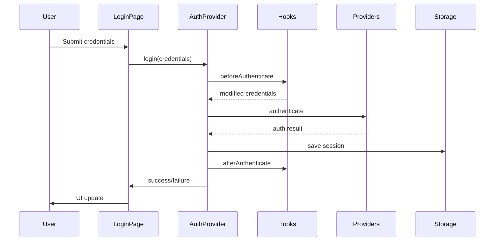

# Authentication Module

The Authentication Module provides the core authentication functionality for the Configurable Authentication Framework, including user authentication, session management, and state persistence.

## Overview

The Authentication Module is designed to be completely configurable via environment variables. When authentication is disabled (`AUTH_ENABLED=false`), the module ensures complete non-interference with existing application functionality while maintaining a consistent API.

### Key Features

- **Environment-based Configuration** - Enable/disable authentication via `AUTH_ENABLED`
- **Session Management** - Secure session handling with configurable expiration
- **State Persistence** - Authentication state persisted across browser sessions
- **External Provider Support** - Pluggable authentication provider system
- **Hook Integration** - Lifecycle hooks for external system integration
- **SSR Compatibility** - Consistent authentication state between server and client
- **Non-Interference** - Complete isolation when authentication is disabled

## Components

### AuthProvider

The core authentication context provider that manages authentication state and operations.

```tsx
import { AuthProvider } from '@/contexts/AuthContext';

function App({ children }) {
  return (
    <AuthProvider>
      {children}
    </AuthProvider>
  );
}
```

**Props:**
```typescript
interface AuthProviderProps {
  children: React.ReactNode
}
```

**Features:**
- Manages authentication state (user, loading, isAuthenticated, error)
- Provides login, logout, and checkAuth methods
- Handles session persistence and expiration (localStorage + cookies)
- Integrates with external authentication providers via AuthProviderRegistry
- Executes authentication lifecycle hooks (beforeAuthenticate, afterAuthenticate, beforeLogout, afterLogout, onAuthDisabled)
- Mock authentication fallback when no providers are registered
- Automatic session loading on mount
- Session expiration checking
- Error handling with fallback configuration

**Session Management:**
- Saves session to localStorage and cookies
- Loads session on mount
- Checks session expiration
- Clears session on logout or expiration
- Uses `STORAGE_KEYS` constants for storage keys

### AuthWrapper

A wrapper component that always provides authentication context. The AuthProvider itself handles disabled auth internally.

```tsx
import { AuthWrapper } from '@/components/AuthWrapper';

function RootLayout({ children }) {
  return (
    <AuthWrapper>
      {children}
    </AuthWrapper>
  );
}
```

**Props:**
```typescript
interface AuthWrapperProps {
  children: React.ReactNode
}
```

**Features:**
- Always provides AuthProvider to avoid conditional hook issues
- Handles authentication disabled state internally
- Ensures non-interference when authentication is disabled
- Consistent API regardless of authentication configuration

### RouteGuard

Component that protects routes based on authentication state and configuration.

```tsx
import { RouteGuard } from '@/components/RouteGuard';

function ProtectedPage() {
  return (
    <RouteGuard requireAuth={true}>
      <ProtectedContent />
    </RouteGuard>
  );
}
```

**Props:**
```typescript
interface RouteGuardProps {
  children: React.ReactNode
  requireAuth?: boolean // Default: true
}
```

**Features:**
- Protects routes based on authentication state
- Redirects to login page if not authenticated (when requireAuth=true)
- Stores return URL for redirect after login
- Shows loading state while checking authentication
- Respects authentication configuration (allows access when auth is disabled)
- Higher-order component `withRouteGuard` available for page protection

### LoginPage

A complete login form component with validation and error handling.

```tsx
import { LoginPage } from '@/components/LoginPage';

function Login() {
  const { login, loading, error } = useAuth();
  
  return (
    <LoginPage
      onLogin={login}
      loading={loading}
      error={error || null}
    />
  );
}
```

**Props:**
```typescript
interface LoginPageProps {
  onLogin: (credentials: LoginCredentials) => Promise<boolean>
  loading: boolean
  error: string | null
}
```

**Features:**
- Form validation with real-time feedback
- Loading states during authentication
- Error message display
- Password visibility toggle
- Responsive design
- Accessibility support (ARIA labels, keyboard navigation)
- Validation error display

### LoginPageContainer

Container component that connects LoginPage with authentication logic using `useLoginPage` hook.

```tsx
import { LoginPageContainer } from '@/components/LoginPageContainer';

function Login() {
  return <LoginPageContainer />;
}
```

**Features:**
- Automatically connects to authentication context
- Handles login logic via `useLoginPage` hook
- Manages loading and error states

## Hooks

### useAuth

The primary hook for accessing authentication state and operations.

```tsx
import { useAuth } from '@/contexts/AuthContext';

function MyComponent() {
  const { 
    isAuthenticated, 
    user, 
    loading, 
    login, 
    logout, 
    checkAuth 
  } = useAuth();
  
  if (loading) return <div>Loading...</div>;
  if (!isAuthenticated) return <LoginForm />;
  
  return <div>Welcome, {user.username}!</div>;
}
```

**Returns:**
- `isAuthenticated: boolean` - Current authentication status
- `user: User | null` - Current user data
- `loading: boolean` - Loading state during operations
- `error: string | undefined` - Error message if any
- `login: (credentials: LoginCredentials) => Promise<boolean>` - Login function
- `logout: () => Promise<void>` - Logout function (returns Promise, not void)
- `checkAuth: () => Promise<void>` - Check authentication status

**Note:** When authentication is disabled (`AUTH_ENABLED=false`), the hook returns a mock authenticated state with an anonymous user.

### useConditionalAuth

A safe authentication hook that works when authentication is disabled. Returns mock authenticated state when auth is disabled.

```tsx
import { useConditionalAuth } from '@/hooks/useConditionalAuth';

function MyComponent() {
  const auth = useConditionalAuth();
  
  // Always returns AuthContextType (never null)
  // When auth is disabled, returns mock authenticated state
  const { isAuthenticated, user } = auth;
  
  if (!isAuthenticated) {
    return <div>Please log in</div>;
  }
  
  return <div>User: {user?.username}</div>;
}
```

**Returns:** `AuthContextType` - Always returns the full auth context type, with mock functions when auth is disabled.

### useExternalAuth

Hook for integrating with external authentication systems. Provides non-interference integration.

```tsx
import { useExternalAuth } from '@/hooks/useExternalAuth';

function ExternalAuthComponent() {
  const { 
    status, 
    syncWithExternal, 
    handleExternalEvent,
    checkExternalAuth,
    registerSyncCallback,
    unregisterSyncCallback,
    isAuthEnabled
  } = useExternalAuth();
  
  // Handle external authentication events
  useEffect(() => {
    const handleExternalLogin = (user) => {
      handleExternalEvent({
        type: 'login',
        user,
        timestamp: new Date()
      });
    };
    
    // Register external event listener
    externalAuthSystem.on('login', handleExternalLogin);
    
    return () => {
      externalAuthSystem.off('login', handleExternalLogin);
    };
  }, [handleExternalEvent]);
}
```

**Returns:**
- `status: ExternalAuthStatus` - External authentication status
- `syncWithExternal: (isAuthenticated: boolean, user?: User) => Promise<void>` - Sync with external auth
- `handleExternalEvent: (event: ExternalAuthEvent) => Promise<void>` - Handle external auth events
- `checkExternalAuth: () => Promise<void>` - Check external auth availability
- `registerSyncCallback: (name: string, callback: Function) => void` - Register sync callback
- `unregisterSyncCallback: (name: string) => void` - Unregister sync callback
- `isAuthEnabled: boolean` - Whether authentication is enabled

**Additional Hooks:**
- `useAuthProviderRegistry()` - Hook for managing authentication providers
- `useAuthHookRegistry()` - Hook for managing authentication hooks

## Configuration

### Environment Variables

```bash
# Enable/disable authentication (default: true)
# Can be set as AUTH_ENABLED or NEXT_PUBLIC_AUTH_ENABLED
AUTH_ENABLED=true
NEXT_PUBLIC_AUTH_ENABLED=true

# Session timeout in milliseconds (default: 3600000 = 1 hour)
# Can be set as SESSION_TIMEOUT or NEXT_PUBLIC_SESSION_TIMEOUT
SESSION_TIMEOUT=3600000
NEXT_PUBLIC_SESSION_TIMEOUT=3600000

# Remember sidebar state (default: true)
# Can be set as REMEMBER_SIDEBAR or NEXT_PUBLIC_REMEMBER_SIDEBAR
REMEMBER_SIDEBAR=true
NEXT_PUBLIC_REMEMBER_SIDEBAR=true

# Default route for the application (default: '/')
# Can be set as DEFAULT_ROUTE or NEXT_PUBLIC_DEFAULT_ROUTE
# NEXT_PUBLIC_DEFAULT_ROUTE takes priority
DEFAULT_ROUTE=/
NEXT_PUBLIC_DEFAULT_ROUTE=/
```

### Configuration Object

```tsx
interface AuthConfig {
  authEnabled: boolean;
  sessionTimeout: number;
  rememberSidebar: boolean;
  defaultRoute: string;
}

// Access configuration
import { ConfigManager } from '@/lib/config';

// Get full config
const config = ConfigManager.getAuthConfig();

// Check if auth is enabled
const isEnabled = ConfigManager.isAuthEnabled();

// Get default route
const defaultRoute = ConfigManager.getDefaultRoute();

// Reset config cache (useful for testing)
ConfigManager.resetConfig();
```

**Configuration Priority:**
- `NEXT_PUBLIC_*` environment variables take priority over non-prefixed versions
- Secure defaults: `authEnabled` defaults to `true` if not set
- Configuration is cached after first access (use `resetConfig()` to clear cache)

## Authentication Flow

### Login Process

1. **User submits credentials** via LoginPage component
2. **Validation** occurs on client-side with real-time feedback
3. **beforeAuthenticate hooks** are executed for external system integration
4. **Authentication providers** attempt authentication in priority order
5. **Session creation** with configurable expiration
6. **State persistence** to localStorage for session recovery
7. **afterAuthenticate hooks** are executed for external system sync
8. **UI update** with authenticated state



### Session Management

Sessions are managed with the following lifecycle:

1. **Creation** - New session created on successful authentication
2. **Persistence** - Session data stored in localStorage and cookies (for SSR compatibility)
3. **Validation** - Session checked on app initialization and periodically
4. **Expiration Checking** - Automatic expiration check using `isSessionExpired()`
5. **Expiration** - Automatic logout when session expires
6. **Cleanup** - Session data cleared on logout (localStorage + cookies)

**Storage Keys:**
- `STORAGE_KEYS.SESSION_DATA` - Session information
- `STORAGE_KEYS.USER_DATA` - User information
- `STORAGE_KEYS.AUTH_TOKEN` - Authentication token
- `STORAGE_KEYS.SIDEBAR_STATE` - Sidebar state (if rememberSidebar is enabled)

```tsx
interface Session {
  token: string;
  userId: string;
  expiresAt: Date;
  createdAt: Date;
}
```

### Logout Process

1. **beforeLogout hooks** are executed
2. **Session invalidation** on server (if applicable)
3. **Local storage cleanup** removes session data
4. **State reset** to unauthenticated
5. **External system sync** notifies external systems
6. **afterLogout hooks** are executed
7. **UI redirect** to login page or public area

## External Provider Integration

### Creating a Custom Provider

```tsx
import { IAuthProvider, AuthResult } from '@/interfaces/AuthProvider';

class MyCustomProvider implements IAuthProvider {
  readonly name = 'my-custom-provider';
  readonly config = {
    name: 'my-custom-provider',
    enabled: true,
    priority: 10,
    settings: { apiUrl: 'https://api.example.com' }
  };

  async initialize(): Promise<void> {
    // Initialize provider (API connections, etc.)
  }

  async authenticate(credentials: LoginCredentials): Promise<AuthResult> {
    try {
      const response = await fetch(`${this.config.settings.apiUrl}/auth`, {
        method: 'POST',
        headers: { 'Content-Type': 'application/json' },
        body: JSON.stringify(credentials)
      });
      
      if (response.ok) {
        const { user, token } = await response.json();
        return {
          success: true,
          user,
          session: {
            token,
            userId: user.id,
            expiresAt: new Date(Date.now() + 3600000),
            createdAt: new Date()
          }
        };
      }
      
      return { success: false, error: 'Authentication failed' };
    } catch (error) {
      return { success: false, error: error.message };
    }
  }

  async validateSession(sessionToken: string): Promise<AuthResult> {
    // Validate session with external system
  }

  async logout(sessionToken: string): Promise<void> {
    // Invalidate session on external system
  }

  async cleanup(): Promise<void> {
    // Cleanup resources
  }
}

// Register the provider
import { authProviderRegistry } from '@/lib/AuthProviderRegistry';
authProviderRegistry.register(new MyCustomProvider());
```

### Authentication Hooks

```tsx
import { IAuthHook } from '@/interfaces/AuthProvider';

class MyAuthHook implements IAuthHook {
  readonly name = 'my-auth-hook';

  async beforeAuthenticate(credentials: LoginCredentials): Promise<LoginCredentials | null> {
    // Modify credentials or block authentication
    return credentials;
  }

  async afterAuthenticate(user: User, session: Session): Promise<void> {
    // Sync with external systems
    await syncUserWithCRM(user);
  }

  async onAuthDisabled(): Promise<void> {
    // Handle authentication disabled state
    console.log('Authentication disabled - ensuring non-interference');
  }
}

// Register the hook
import { authHookRegistry } from '@/lib/AuthProviderRegistry';
authHookRegistry.registerHook(new MyAuthHook());
```

## API Reference

### Types

```tsx
interface User {
  id: string;
  username: string;
  email?: string;
  roles: string[];
  lastLogin: Date;
  metadata?: Record<string, any>;
}

interface LoginCredentials {
  username: string;
  password: string;
  rememberMe?: boolean;
  metadata?: Record<string, any>;
}

interface AuthState {
  isAuthenticated: boolean;
  user: User | null;
  loading: boolean;
}

interface AuthContextType extends AuthState {
  login: (credentials: LoginCredentials) => Promise<boolean>;
  logout: () => Promise<void>;
  checkAuth: () => Promise<void>;
}
```

### Error Handling

The authentication module provides specific error types:

```tsx
class AuthenticationError extends Error {
  constructor(message: string, public code: string) {
    super(message);
    this.name = 'AuthenticationError';
  }
}

// Common error codes
const AUTH_ERROR_CODES = {
  INVALID_CREDENTIALS: 'INVALID_CREDENTIALS',
  SESSION_EXPIRED: 'SESSION_EXPIRED',
  PROVIDER_UNAVAILABLE: 'PROVIDER_UNAVAILABLE',
  EXTERNAL_SYSTEM_ERROR: 'EXTERNAL_SYSTEM_ERROR'
};
```

## Testing

### Unit Testing

```tsx
import { render, screen, fireEvent, waitFor } from '@testing-library/react';
import { AuthProvider, useAuth } from '@/contexts/AuthContext';

function TestComponent() {
  const { login, isAuthenticated } = useAuth();
  
  return (
    <div>
      <div data-testid="status">
        {isAuthenticated ? 'authenticated' : 'not-authenticated'}
      </div>
      <button onClick={() => login({ username: 'test', password: 'test' })}>
        Login
      </button>
    </div>
  );
}

test('should authenticate user on login', async () => {
  render(
    <AuthProvider>
      <TestComponent />
    </AuthProvider>
  );
  
  expect(screen.getByTestId('status')).toHaveTextContent('not-authenticated');
  
  fireEvent.click(screen.getByText('Login'));
  
  await waitFor(() => {
    expect(screen.getByTestId('status')).toHaveTextContent('authenticated');
  });
});
```

### Property Testing

```tsx
import * as fc from 'fast-check';

describe('Authentication Properties', () => {
  it('should maintain authentication state consistency', () => {
    fc.assert(
      fc.property(
        fc.record({
          authEnabled: fc.boolean(),
          credentials: fc.record({
            username: fc.string(),
            password: fc.string()
          })
        }),
        async (testConfig) => {
          // Property: Authentication state should be consistent
          const { authEnabled, credentials } = testConfig;
          
          // Test authentication behavior
          const result = await testAuthentication(authEnabled, credentials);
          
          if (!authEnabled) {
            // When disabled, should not interfere
            expect(result.interfered).toBe(false);
          } else {
            // When enabled, should follow normal flow
            expect(result.followsFlow).toBe(true);
          }
        }
      ),
      { numRuns: 100 }
    );
  });
});
```

## Troubleshooting

### Common Issues

#### 1. "useAuth must be used within an AuthProvider"

**Cause:** Component using `useAuth` is not wrapped with `AuthProvider`

**Solution:**
```tsx
// Wrap your app with AuthProvider
<AuthProvider>
  <YourComponent />
</AuthProvider>

// Or use useConditionalAuth for optional authentication
const auth = useConditionalAuth();
if (!auth) return <div>No auth context</div>;
```

#### 2. Authentication state not persisting

**Cause:** localStorage issues or session expiration

**Solution:**
```tsx
// Check localStorage availability
if (typeof window !== 'undefined' && window.localStorage) {
  // localStorage is available
}

// Check session expiration
const session = loadSession();
if (session && isSessionExpired(session.expiresAt)) {
  // Session expired, need to re-authenticate
}
```

#### 3. External provider not working

**Cause:** Provider not registered or initialization failed

**Solution:**
```tsx
// Ensure provider is registered
import { authProviderRegistry } from '@/lib/AuthProviderRegistry';
const provider = new MyProvider();
authProviderRegistry.register(provider);

// Check provider health
const isHealthy = await provider.healthCheck();
if (!isHealthy) {
  // Handle provider unavailability
}
```

### Performance Considerations

1. **Session Validation** - Avoid excessive session validation calls
2. **State Updates** - Batch authentication state updates
3. **Provider Priority** - Order providers by performance and reliability
4. **Hook Execution** - Keep authentication hooks lightweight

### Security Best Practices

1. **Token Storage** - Use secure storage for sensitive tokens
2. **Session Expiration** - Implement reasonable session timeouts
3. **HTTPS Only** - Always use HTTPS in production
4. **Input Validation** - Validate all authentication inputs
5. **Error Messages** - Avoid revealing sensitive information in errors

## Migration Guide

### From NextAuth.js

```tsx
// Before (NextAuth.js)
import { useSession } from 'next-auth/react';

function Component() {
  const { data: session, status } = useSession();
  
  if (status === 'loading') return <div>Loading...</div>;
  if (!session) return <div>Not authenticated</div>;
  
  return <div>Welcome {session.user.name}</div>;
}

// After (Configurable Auth Framework)
import { useAuth } from '@/contexts/AuthContext';

function Component() {
  const { user, loading, isAuthenticated } = useAuth();
  
  if (loading) return <div>Loading...</div>;
  if (!isAuthenticated) return <div>Not authenticated</div>;
  
  return <div>Welcome {user.username}</div>;
}
```

### From Auth0

```tsx
// Before (Auth0)
import { useAuth0 } from '@auth0/auth0-react';

function Component() {
  const { user, isAuthenticated, isLoading, loginWithRedirect, logout } = useAuth0();
  
  if (isLoading) return <div>Loading...</div>;
  
  return (
    <div>
      {isAuthenticated ? (
        <div>
          <p>Welcome {user.name}</p>
          <button onClick={() => logout({ returnTo: window.location.origin })}>
            Logout
          </button>
        </div>
      ) : (
        <button onClick={() => loginWithRedirect()}>Login</button>
      )}
    </div>
  );
}

// After (Configurable Auth Framework)
import { useAuth } from '@/contexts/AuthContext';

function Component() {
  const { user, isAuthenticated, loading, logout } = useAuth();
  
  if (loading) return <div>Loading...</div>;
  
  return (
    <div>
      {isAuthenticated ? (
        <div>
          <p>Welcome {user.username}</p>
          <button onClick={logout}>Logout</button>
        </div>
      ) : (
        <LoginPage />
      )}
    </div>
  );
}
```

## Requirements Mapping

This module implements the following requirements:

- **2.1** - User authentication with username/password
- **2.2** - Authentication state management and context
- **2.3** - Invalid credentials handling and error display
- **2.4** - Session persistence and lifecycle management
- **2.5** - Loading states during authentication operations
- **4.1** - Session creation and management
- **4.2** - Session persistence across browser sessions
- **4.3** - Session expiration handling
- **4.4** - Session validation and refresh
- **4.5** - Session cleanup on logout
- **5.1** - External authentication provider interfaces
- **5.2** - Authentication lifecycle hooks
- **5.3** - External system integration
- **5.4** - Non-interference when authentication disabled