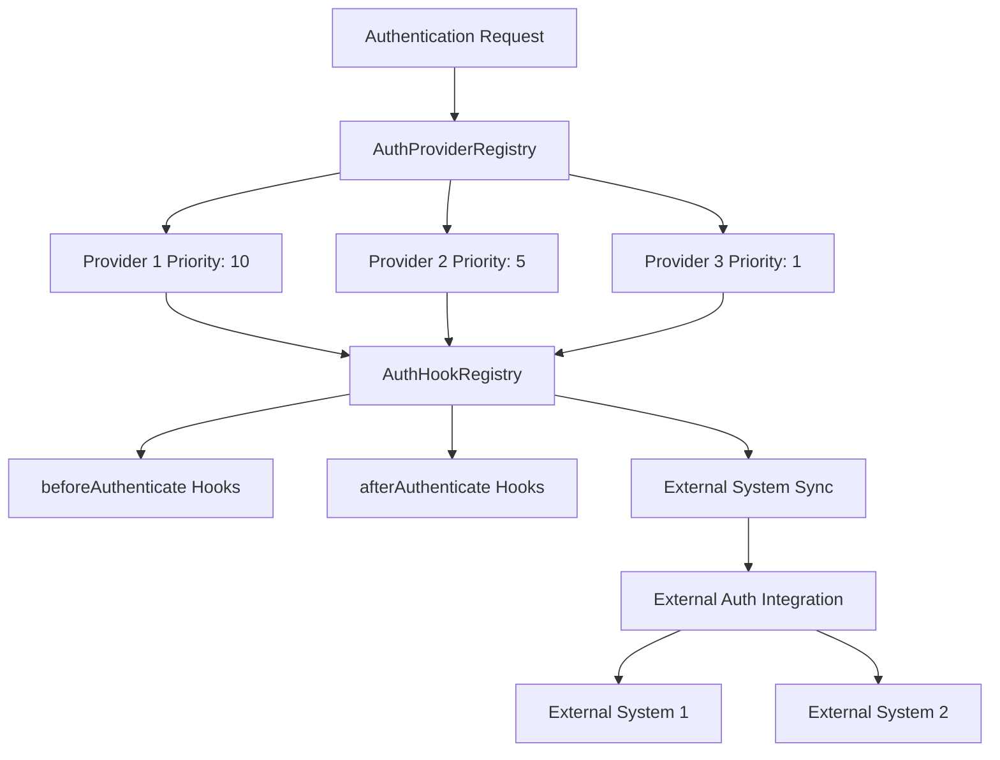

# External System Integration Module

The External System Integration Module provides a comprehensive framework for integrating with external authentication systems while ensuring complete non-interference when authentication is disabled.

## Overview

This module enables seamless integration with external authentication providers and systems through a pluggable architecture. It provides authentication providers, lifecycle hooks, and external system synchronization while maintaining strict non-interference guarantees.

### Key Features

- **Pluggable Provider System** - Custom authentication providers with priority-based execution
- **Lifecycle Hooks** - Integration points throughout the authentication lifecycle
- **Non-Interference Guarantees** - Complete isolation when authentication is disabled
- **External System Sync** - Bidirectional synchronization with external systems
- **Provider Registry** - Centralized management of authentication providers
- **Hook Registry** - Centralized management of authentication hooks
- **Health Monitoring** - Provider health checking and failover support

## Architecture



## Authentication Providers

### IAuthProvider Interface

```typescript
interface IAuthProvider {
  readonly name: string;
  readonly config: AuthProviderConfig;
  
  initialize(): Promise<void>;
  authenticate(credentials: LoginCredentials): Promise<AuthResult>;
  validateSession(sessionToken: string): Promise<AuthResult>;
  refreshSession(refreshToken: string): Promise<AuthResult>;
  logout(sessionToken: string): Promise<void>;
  getUserProfile(userId: string): Promise<User | null>;
  healthCheck(): Promise<boolean>;
  cleanup(): Promise<void>;
}

interface AuthProviderConfig {
  name: string;
  enabled: boolean;
  priority: number;
  settings: Record<string, any>;
}

interface AuthResult {
  success: boolean;
  user?: User;
  session?: Session;
  error?: string;
  redirectUrl?: string;
}
```

### Creating Custom Providers

#### Basic Provider Implementation

```typescript
import { IAuthProvider, AuthResult, AuthProviderConfig } from '@/interfaces/AuthProvider';

class CustomAuthProvider implements IAuthProvider {
  readonly name = 'custom-auth-provider';
  readonly config: AuthProviderConfig;

  constructor(config: Partial<AuthProviderConfig> = {}) {
    this.config = {
      name: this.name,
      enabled: true,
      priority: 5,
      settings: {},
      ...config,
    };
  }

  async initialize(): Promise<void> {
    console.log(`Initializing ${this.name}`);
    
    // Initialize connections, validate settings, etc.
    if (this.config.settings.apiUrl) {
      await this.validateConnection();
    }
  }

  async authenticate(credentials: LoginCredentials): Promise<AuthResult> {
    try {
      const response = await fetch(`${this.config.settings.apiUrl}/auth`, {
        method: 'POST',
        headers: { 'Content-Type': 'application/json' },
        body: JSON.stringify(credentials)
      });

      if (response.ok) {
        const { user, token } = await response.json();
        return {
          success: true,
          user,
          session: {
            token,
            userId: user.id,
            expiresAt: new Date(Date.now() + 3600000),
            createdAt: new Date()
          }
        };
      }

      return { 
        success: false, 
        error: 'Authentication failed' 
      };
    } catch (error) {
      return { 
        success: false, 
        error: error.message 
      };
    }
  }

  async validateSession(sessionToken: string): Promise<AuthResult> {
    try {
      const response = await fetch(`${this.config.settings.apiUrl}/validate`, {
        headers: { 'Authorization': `Bearer ${sessionToken}` }
      });

      if (response.ok) {
        const { user } = await response.json();
        return { success: true, user };
      }

      return { success: false, error: 'Invalid session' };
    } catch (error) {
      return { success: false, error: error.message };
    }
  }

  async refreshSession(refreshToken: string): Promise<AuthResult> {
    // Implement session refresh logic
    return { success: false, error: 'Refresh not supported' };
  }

  async logout(sessionToken: string): Promise<void> {
    try {
      await fetch(`${this.config.settings.apiUrl}/logout`, {
        method: 'POST',
        headers: { 'Authorization': `Bearer ${sessionToken}` }
      });
    } catch (error) {
      console.error('Logout failed:', error);
    }
  }

  async getUserProfile(userId: string): Promise<User | null> {
    try {
      const response = await fetch(`${this.config.settings.apiUrl}/users/${userId}`);
      if (response.ok) {
        return await response.json();
      }
    } catch (error) {
      console.error('Failed to get user profile:', error);
    }
    return null;
  }

  async healthCheck(): Promise<boolean> {
    try {
      const response = await fetch(`${this.config.settings.apiUrl}/health`);
      return response.ok;
    } catch (error) {
      return false;
    }
  }

  async cleanup(): Promise<void> {
    console.log(`Cleaning up ${this.name}`);
    // Close connections, clear caches, etc.
  }

  private async validateConnection(): Promise<void> {
    const isHealthy = await this.healthCheck();
    if (!isHealthy) {
      throw new Error(`Cannot connect to ${this.config.settings.apiUrl}`);
    }
  }
}
```

#### Advanced Provider with Caching

```typescript
class CachedAuthProvider implements IAuthProvider {
  readonly name = 'cached-auth-provider';
  readonly config: AuthProviderConfig;
  private cache = new Map<string, { data: any; expires: number }>();

  constructor(config: Partial<AuthProviderConfig> = {}) {
    this.config = {
      name: this.name,
      enabled: true,
      priority: 8,
      settings: {
        cacheTimeout: 300000, // 5 minutes
        ...config.settings
      },
      ...config,
    };
  }

  async authenticate(credentials: LoginCredentials): Promise<AuthResult> {
    const cacheKey = `auth:${credentials.username}`;
    
    // Check cache first
    const cached = this.getFromCache(cacheKey);
    if (cached) {
      return cached;
    }

    // Perform authentication
    const result = await this.performAuthentication(credentials);
    
    // Cache successful results
    if (result.success) {
      this.setCache(cacheKey, result, this.config.settings.cacheTimeout);
    }

    return result;
  }

  async validateSession(sessionToken: string): Promise<AuthResult> {
    const cacheKey = `session:${sessionToken}`;
    
    const cached = this.getFromCache(cacheKey);
    if (cached) {
      return cached;
    }

    const result = await this.performSessionValidation(sessionToken);
    
    if (result.success) {
      this.setCache(cacheKey, result, this.config.settings.cacheTimeout);
    }

    return result;
  }

  private getFromCache(key: string): any | null {
    const cached = this.cache.get(key);
    if (cached && cached.expires > Date.now()) {
      return cached.data;
    }
    
    if (cached) {
      this.cache.delete(key);
    }
    
    return null;
  }

  private setCache(key: string, data: any, timeout: number): void {
    this.cache.set(key, {
      data,
      expires: Date.now() + timeout
    });
  }

  // ... other required methods
}
```

### Provider Registration

```typescript
import { authProviderRegistry } from '@/lib/AuthProviderRegistry';

// Register providers
const customProvider = new CustomAuthProvider({
  settings: {
    apiUrl: 'https://auth.example.com',
    timeout: 5000
  }
});

const cachedProvider = new CachedAuthProvider({
  priority: 10, // Higher priority
  settings: {
    apiUrl: 'https://cache-auth.example.com',
    cacheTimeout: 600000
  }
});

authProviderRegistry.register(customProvider);
authProviderRegistry.register(cachedProvider);

// Initialize all providers
await authProviderRegistry.initialize();
```

## Authentication Hooks

### IAuthHook Interface

```typescript
interface IAuthHook {
  readonly name: string;
  
  beforeAuthenticate?(credentials: LoginCredentials): Promise<LoginCredentials | null>;
  afterAuthenticate?(user: User, session: Session): Promise<void>;
  beforeValidateSession?(sessionToken: string): Promise<string | null>;
  afterValidateSession?(user: User, session: Session): Promise<void>;
  beforeLogout?(user: User, session: Session): Promise<void>;
  afterLogout?(userId: string): Promise<void>;
  onAuthDisabled?(): Promise<void>;
}
```

### Creating Custom Hooks

#### Analytics Hook

```typescript
class AnalyticsAuthHook implements IAuthHook {
  readonly name = 'analytics-auth-hook';
  
  private analytics: AnalyticsService;

  constructor(analytics: AnalyticsService) {
    this.analytics = analytics;
  }

  async beforeAuthenticate(credentials: LoginCredentials): Promise<LoginCredentials | null> {
    // Track login attempt
    this.analytics.track('login_attempt', {
      username: credentials.username,
      timestamp: new Date().toISOString(),
      userAgent: navigator.userAgent
    });

    // Add analytics metadata
    return {
      ...credentials,
      metadata: {
        ...credentials.metadata,
        analyticsSessionId: this.analytics.getSessionId(),
        loginAttemptId: generateId()
      }
    };
  }

  async afterAuthenticate(user: User, session: Session): Promise<void> {
    // Track successful login
    this.analytics.track('login_success', {
      userId: user.id,
      username: user.username,
      sessionId: session.token,
      timestamp: new Date().toISOString()
    });

    // Set user context
    this.analytics.setUser({
      id: user.id,
      username: user.username,
      roles: user.roles
    });
  }

  async afterLogout(userId: string): Promise<void> {
    // Track logout
    this.analytics.track('logout', {
      userId,
      timestamp: new Date().toISOString()
    });

    // Clear user context
    this.analytics.clearUser();
  }

  async onAuthDisabled(): Promise<void> {
    // Track auth disabled event
    this.analytics.track('auth_disabled', {
      timestamp: new Date().toISOString(),
      reason: 'configuration'
    });
  }
}
```

#### Security Hook

```typescript
class SecurityAuthHook implements IAuthHook {
  readonly name = 'security-auth-hook';
  
  private securityService: SecurityService;
  private rateLimiter: RateLimiter;

  constructor(securityService: SecurityService) {
    this.securityService = securityService;
    this.rateLimiter = new RateLimiter({
      windowMs: 15 * 60 * 1000, // 15 minutes
      max: 5 // 5 attempts per window
    });
  }

  async beforeAuthenticate(credentials: LoginCredentials): Promise<LoginCredentials | null> {
    const clientIP = this.getClientIP();
    
    // Check rate limiting
    if (!this.rateLimiter.isAllowed(clientIP)) {
      console.warn(`Rate limit exceeded for IP: ${clientIP}`);
      return null; // Block authentication
    }

    // Check for suspicious activity
    const isSuspicious = await this.securityService.checkSuspiciousActivity({
      username: credentials.username,
      ip: clientIP,
      userAgent: navigator.userAgent
    });

    if (isSuspicious) {
      console.warn(`Suspicious activity detected for user: ${credentials.username}`);
      // Could return null to block, or add security flags
      return {
        ...credentials,
        metadata: {
          ...credentials.metadata,
          securityFlags: ['suspicious_activity'],
          requiresAdditionalVerification: true
        }
      };
    }

    return credentials;
  }

  async afterAuthenticate(user: User, session: Session): Promise<void> {
    // Log successful authentication
    await this.securityService.logSecurityEvent({
      type: 'authentication_success',
      userId: user.id,
      ip: this.getClientIP(),
      timestamp: new Date(),
      sessionId: session.token
    });

    // Check for concurrent sessions
    const activeSessions = await this.securityService.getActiveSessions(user.id);
    if (activeSessions.length > 3) {
      console.warn(`Multiple active sessions for user: ${user.id}`);
      // Could terminate old sessions or require verification
    }
  }

  async beforeLogout(user: User, session: Session): Promise<void> {
    // Log logout initiation
    await this.securityService.logSecurityEvent({
      type: 'logout_initiated',
      userId: user.id,
      sessionId: session.token,
      timestamp: new Date()
    });
  }

  private getClientIP(): string {
    // Implementation to get client IP
    return '127.0.0.1'; // Placeholder
  }
}
```

### Hook Registration

```typescript
import { authHookRegistry } from '@/lib/AuthProviderRegistry';

// Register hooks
const analyticsHook = new AnalyticsAuthHook(analyticsService);
const securityHook = new SecurityAuthHook(securityService);

authHookRegistry.registerHook(analyticsHook);
authHookRegistry.registerHook(securityHook);
```

## External System Integration

### IExternalAuthIntegration Interface

```typescript
interface IExternalAuthIntegration {
  isExternalAuthAvailable(): Promise<boolean>;
  getExternalAuthStatus(): Promise<{
    isAuthenticated: boolean;
    user?: User;
    expiresAt?: Date;
  }>;
  syncWithExternalAuth(isAuthenticated: boolean, user?: User): Promise<void>;
  handleExternalAuthEvent(event: {
    type: 'login' | 'logout' | 'session_expired' | 'user_updated';
    user?: User;
    timestamp: Date;
  }): Promise<void>;
  cleanup(): Promise<void>;
}
```

### External System Implementations

#### Auth0 Integration

```typescript
class Auth0Integration implements IExternalAuthIntegration {
  private auth0Client: Auth0Client;

  constructor(config: Auth0Config) {
    this.auth0Client = new Auth0Client(config);
  }

  async isExternalAuthAvailable(): Promise<boolean> {
    try {
      await this.auth0Client.checkSession();
      return true;
    } catch (error) {
      return false;
    }
  }

  async getExternalAuthStatus(): Promise<{
    isAuthenticated: boolean;
    user?: User;
    expiresAt?: Date;
  }> {
    try {
      const isAuthenticated = await this.auth0Client.isAuthenticated();
      
      if (isAuthenticated) {
        const auth0User = await this.auth0Client.getUser();
        const user = this.mapAuth0User(auth0User);
        
        return {
          isAuthenticated: true,
          user,
          expiresAt: new Date(Date.now() + 3600000) // 1 hour
        };
      }
      
      return { isAuthenticated: false };
    } catch (error) {
      console.error('Auth0 status check failed:', error);
      return { isAuthenticated: false };
    }
  }

  async syncWithExternalAuth(isAuthenticated: boolean, user?: User): Promise<void> {
    if (!ConfigManager.isAuthEnabled()) {
      return; // Don't interfere when auth is disabled
    }

    try {
      if (isAuthenticated && user) {
        // Sync user data with Auth0
        await this.auth0Client.updateUser(user.id, {
          user_metadata: {
            lastLogin: user.lastLogin,
            roles: user.roles
          }
        });
      }
    } catch (error) {
      console.error('Auth0 sync failed:', error);
    }
  }

  async handleExternalAuthEvent(event: {
    type: 'login' | 'logout' | 'session_expired' | 'user_updated';
    user?: User;
    timestamp: Date;
  }): Promise<void> {
    if (!ConfigManager.isAuthEnabled()) {
      return; // Don't interfere when auth is disabled
    }

    switch (event.type) {
      case 'login':
        console.log('Auth0 user logged in:', event.user?.username);
        break;
      case 'logout':
        console.log('Auth0 user logged out');
        break;
      case 'session_expired':
        console.log('Auth0 session expired');
        break;
      case 'user_updated':
        console.log('Auth0 user updated:', event.user?.username);
        break;
    }
  }

  async cleanup(): Promise<void> {
    // Cleanup Auth0 client resources
    this.auth0Client.logout({ returnTo: window.location.origin });
  }

  private mapAuth0User(auth0User: any): User {
    return {
      id: auth0User.sub,
      username: auth0User.nickname || auth0User.email,
      email: auth0User.email,
      roles: auth0User['https://app.example.com/roles'] || ['user'],
      lastLogin: new Date(auth0User.updated_at)
    };
  }
}
```

#### Firebase Integration

```typescript
class FirebaseIntegration implements IExternalAuthIntegration {
  private auth: FirebaseAuth;

  constructor(firebaseConfig: FirebaseConfig) {
    const app = initializeApp(firebaseConfig);
    this.auth = getAuth(app);
  }

  async isExternalAuthAvailable(): Promise<boolean> {
    return new Promise((resolve) => {
      const unsubscribe = onAuthStateChanged(this.auth, (user) => {
        unsubscribe();
        resolve(true);
      }, (error) => {
        unsubscribe();
        resolve(false);
      });
    });
  }

  async getExternalAuthStatus(): Promise<{
    isAuthenticated: boolean;
    user?: User;
    expiresAt?: Date;
  }> {
    const firebaseUser = this.auth.currentUser;
    
    if (firebaseUser) {
      const user = await this.mapFirebaseUser(firebaseUser);
      const tokenResult = await firebaseUser.getIdTokenResult();
      
      return {
        isAuthenticated: true,
        user,
        expiresAt: new Date(tokenResult.expirationTime)
      };
    }
    
    return { isAuthenticated: false };
  }

  async syncWithExternalAuth(isAuthenticated: boolean, user?: User): Promise<void> {
    if (!ConfigManager.isAuthEnabled()) {
      return;
    }

    try {
      const firebaseUser = this.auth.currentUser;
      
      if (isAuthenticated && user && firebaseUser) {
        // Update Firebase user profile
        await updateProfile(firebaseUser, {
          displayName: user.username
        });

        // Set custom claims if needed
        // Note: This typically requires Firebase Admin SDK on server
        await this.setCustomClaims(firebaseUser.uid, {
          roles: user.roles,
          lastLogin: user.lastLogin.toISOString()
        });
      }
    } catch (error) {
      console.error('Firebase sync failed:', error);
    }
  }

  async handleExternalAuthEvent(event: {
    type: 'login' | 'logout' | 'session_expired' | 'user_updated';
    user?: User;
    timestamp: Date;
  }): Promise<void> {
    if (!ConfigManager.isAuthEnabled()) {
      return;
    }

    // Handle Firebase-specific events
    console.log('Firebase auth event:', event.type, event.user?.username);
  }

  async cleanup(): Promise<void> {
    await signOut(this.auth);
  }

  private async mapFirebaseUser(firebaseUser: FirebaseUser): Promise<User> {
    const tokenResult = await firebaseUser.getIdTokenResult();
    const customClaims = tokenResult.claims;

    return {
      id: firebaseUser.uid,
      username: firebaseUser.displayName || firebaseUser.email || 'Unknown',
      email: firebaseUser.email || undefined,
      roles: customClaims.roles || ['user'],
      lastLogin: new Date(firebaseUser.metadata.lastSignInTime || Date.now())
    };
  }

  private async setCustomClaims(uid: string, claims: any): Promise<void> {
    // This would typically be done on the server with Firebase Admin SDK
    // For client-side, you might call your API endpoint
    try {
      await fetch('/api/auth/set-claims', {
        method: 'POST',
        headers: { 'Content-Type': 'application/json' },
        body: JSON.stringify({ uid, claims })
      });
    } catch (error) {
      console.error('Failed to set custom claims:', error);
    }
  }
}
```

## Usage Examples

### Complete Integration Setup

```typescript
// providers/setup.ts
import { authProviderRegistry, authHookRegistry, externalAuthIntegration } from '@/lib/AuthProviderRegistry';

export async function setupExternalIntegration() {
  // Register custom authentication provider
  const customProvider = new CustomAuthProvider({
    priority: 10,
    settings: {
      apiUrl: process.env.CUSTOM_AUTH_API_URL,
      timeout: 5000
    }
  });
  
  authProviderRegistry.register(customProvider);

  // Register authentication hooks
  const analyticsHook = new AnalyticsAuthHook(analyticsService);
  const securityHook = new SecurityAuthHook(securityService);
  
  authHookRegistry.registerHook(analyticsHook);
  authHookRegistry.registerHook(securityHook);

  // Set up external system integration
  if (process.env.AUTH0_DOMAIN) {
    const auth0Integration = new Auth0Integration({
      domain: process.env.AUTH0_DOMAIN,
      clientId: process.env.AUTH0_CLIENT_ID
    });
    
    externalAuthIntegration.registerSyncCallback('auth0', async (data) => {
      await auth0Integration.syncWithExternalAuth(data.isAuthenticated, data.user);
    });
  }

  // Initialize all providers
  await authProviderRegistry.initialize();
}

// Call during app initialization
setupExternalIntegration();
```

### React Hook Integration

```typescript
import { useExternalAuth } from '@/hooks/useExternalAuth';

function ExternalAuthStatus() {
  const { 
    status, 
    syncWithExternal, 
    handleExternalEvent,
    registerSyncCallback 
  } = useExternalAuth();

  useEffect(() => {
    // Register sync callback for external system
    registerSyncCallback('my-system', async (data) => {
      console.log('Syncing with external system:', data);
      // Custom sync logic
    });

    // Handle external auth events
    const handleAuth0Login = (user) => {
      handleExternalEvent({
        type: 'login',
        user,
        timestamp: new Date()
      });
    };

    // Listen for external system events
    window.addEventListener('auth0-login', handleAuth0Login);

    return () => {
      window.removeEventListener('auth0-login', handleAuth0Login);
    };
  }, [handleExternalEvent, registerSyncCallback]);

  return (
    <div>
      <h3>External Auth Status</h3>
      <p>Available: {status.isAvailable ? 'Yes' : 'No'}</p>
      <p>Authenticated: {status.isAuthenticated ? 'Yes' : 'No'}</p>
      {status.user && <p>User: {status.user.username}</p>}
      {status.error && <p>Error: {status.error}</p>}
    </div>
  );
}
```

## Testing

### Provider Testing

```typescript
import { MockAuthProvider } from '@/providers/MockAuthProvider';

describe('CustomAuthProvider', () => {
  let provider: CustomAuthProvider;

  beforeEach(() => {
    provider = new CustomAuthProvider({
      settings: {
        apiUrl: 'https://test-api.example.com'
      }
    });
  });

  test('should authenticate valid credentials', async () => {
    const credentials = {
      username: 'testuser',
      password: 'testpass'
    };

    const result = await provider.authenticate(credentials);

    expect(result.success).toBe(true);
    expect(result.user).toBeDefined();
    expect(result.session).toBeDefined();
  });

  test('should handle authentication failure', async () => {
    const credentials = {
      username: 'invalid',
      password: 'invalid'
    };

    const result = await provider.authenticate(credentials);

    expect(result.success).toBe(false);
    expect(result.error).toBeDefined();
  });

  test('should validate sessions correctly', async () => {
    const validToken = 'valid-session-token';
    const result = await provider.validateSession(validToken);

    expect(result.success).toBe(true);
    expect(result.user).toBeDefined();
  });
});
```

### Hook Testing

```typescript
import { ExampleAuthHook } from '@/hooks/ExampleAuthHook';

describe('ExampleAuthHook', () => {
  let hook: ExampleAuthHook;

  beforeEach(() => {
    hook = new ExampleAuthHook();
  });

  test('should modify credentials in beforeAuthenticate', async () => {
    const credentials = {
      username: 'testuser',
      password: 'testpass'
    };

    const result = await hook.beforeAuthenticate(credentials);

    expect(result).toBeDefined();
    expect(result?.metadata).toBeDefined();
    expect(result?.metadata?.externalSystemId).toBeDefined();
  });

  test('should handle onAuthDisabled correctly', async () => {
    const consoleSpy = jest.spyOn(console, 'log');

    await hook.onAuthDisabled();

    expect(consoleSpy).toHaveBeenCalledWith(
      expect.stringContaining('Authentication disabled')
    );
  });
});
```

### Integration Testing

```typescript
import { authProviderRegistry, authHookRegistry } from '@/lib/AuthProviderRegistry';

describe('External Integration', () => {
  beforeEach(() => {
    authProviderRegistry.cleanup();
    authHookRegistry.getAllHooks().forEach(hook => {
      authHookRegistry.unregisterHook(hook.name);
    });
  });

  test('should integrate providers and hooks correctly', async () => {
    const provider = new MockAuthProvider();
    const hook = new ExampleAuthHook();

    authProviderRegistry.register(provider);
    authHookRegistry.registerHook(hook);

    await authProviderRegistry.initialize();

    const credentials = { username: 'test', password: 'test' };
    const result = await authProviderRegistry.authenticate(credentials);

    expect(result.success).toBe(true);
    expect(hook.beforeAuthenticate).toHaveBeenCalled();
    expect(hook.afterAuthenticate).toHaveBeenCalled();
  });
});
```

## Troubleshooting

### Common Issues

#### 1. Provider not being called

**Cause:** Provider not registered or disabled

**Solution:**
```typescript
// Check provider registration
const providers = authProviderRegistry.getAllProviders();
console.log('Registered providers:', providers.map(p => p.name));

// Check provider status
const enabledProviders = authProviderRegistry.getEnabledProviders();
console.log('Enabled providers:', enabledProviders.map(p => p.name));
```

#### 2. Hook not executing

**Cause:** Hook not registered or error in hook execution

**Solution:**
```typescript
// Check hook registration
const hooks = authHookRegistry.getAllHooks();
console.log('Registered hooks:', hooks.map(h => h.name));

// Add error handling in hooks
async beforeAuthenticate(credentials: LoginCredentials): Promise<LoginCredentials | null> {
  try {
    // Hook logic
    return credentials;
  } catch (error) {
    console.error(`Hook ${this.name} failed:`, error);
    return credentials; // Return original credentials on error
  }
}
```

#### 3. External system sync failing

**Cause:** Network issues, authentication problems, or configuration errors

**Solution:**
```typescript
// Add retry logic
async syncWithExternalAuth(isAuthenticated: boolean, user?: User): Promise<void> {
  const maxRetries = 3;
  let retries = 0;

  while (retries < maxRetries) {
    try {
      await this.performSync(isAuthenticated, user);
      return;
    } catch (error) {
      retries++;
      console.warn(`Sync attempt ${retries} failed:`, error);
      
      if (retries >= maxRetries) {
        console.error('Max sync retries exceeded');
        throw error;
      }
      
      await new Promise(resolve => setTimeout(resolve, 1000 * retries));
    }
  }
}
```

## Requirements Mapping

This module implements the following requirements:

- **5.1** - External authentication provider interfaces and pluggable architecture
- **5.2** - Authentication lifecycle hooks for external system integration
- **5.3** - External system integration with bidirectional synchronization
- **5.4** - Non-interference guarantees when authentication is disabled
- **7.3** - Comprehensive documentation and examples for external integration
- **7.6** - API documentation for provider and hook interfaces